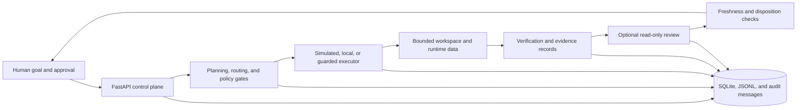

# AI-Dev-Orchestrator

An early-stage orchestration system for evidence-driven AI software-engineering workflows.

[English](README.md) | [简体中文](README.zh-CN.md)

> **Status: Early-stage / Maintainer Preview / Experimental**
>
> The repository contains a substantial local control plane and a growing set of
> guarded execution and review contracts. It is not production hardened, the
> test suite still emits substantial deprecation warnings, and several
> executor-backed paths remain controlled-smoke or partial integrations.

## Project Status

Development is active on the repository's `main` branch, but no stable release
or support channel exists. Treat APIs, persisted data, and executor contracts as
subject to change until a maintainer publishes a compatibility policy. Current
evidence and gaps are tracked in [Project Status](docs/PROJECT_STATUS.md).

## What It Is

AI-Dev-Orchestrator explores how a coding-agent workflow can be made inspectable
and bounded instead of treating an agent invocation as a single opaque action.
It is intended for maintainers and contributors studying local AI-assisted
software delivery, review gates, human approval, evidence records, and controlled
tool execution.

A basic coding-agent wrapper usually forwards a prompt to a model or CLI. This
project models additional stages around that action: task planning and routing,
execution preconditions, workspace boundaries, verification evidence, read-only
review contracts, disposition freshness checks, audit records, and human
escalation. These controls reduce risk; they do not make generated changes safe
by default.

## Problem Statement

Coding agents can read untrusted repositories, execute shell commands, modify
files, call external providers, and produce plausible but incorrect reviews.
Without explicit boundaries it is difficult to answer:

- what the agent was allowed to do;
- which evidence a decision used;
- whether a review applies to the current diff;
- when a human approved a risky transition; or
- what happened after a run failed.

This repository makes those questions first-class domain and service concerns.

## Current Capabilities

The following capabilities have code and test coverage in the repository. The
qualifiers are important.

- **Local orchestration control plane:** FastAPI services and a React/Vite web
  application for projects, tasks, runs, approvals, deliverables, costs, agent
  sessions, and repository-oriented workflows.
- **Task execution and verification:** simulated and local-command execution,
  verification templates, budget and retry guards, structured run logs, and
  SQLite-backed state.
- **Provider abstraction:** mock and OpenAI-compatible provider services with
  configurable endpoints and masked configuration summaries. Real calls require
  operator-supplied credentials and have not been validated here against every
  compatible provider.
- **Bounded external-executor contracts:** explicit preflight, launch, supervisor,
  readback, timeout, and cleanup components. Native executor paths are
  experimental and commonly exercised through dry-run or controlled-smoke
  modes, not as an unattended production runtime.
- **Sandbox-oriented workspace controls:** backend-owned workspace roots,
  normalized names, containment checks, operation manifests, candidate-file
  writes, and diff generation. These are incremental guarded stages, not a
  formally isolated security sandbox.
- **Read-only review stages:** dry-run, fake-review, native, and Codex app-server
  transport contracts exist for selected Project Director flows. Independent
  review is not automatically applied to every execution path.
- **Evidence-based gates:** hashes, source bindings, schema checks, append-only
  messages, and freshness revalidation are used in selected review and
  disposition flows to reject mismatched, stale, or already-consumed evidence.
- **Human approval and escalation:** approval records, explicit confirmation
  fields, blocking reasons, and escalation-oriented workflow states exist in
  the backend and control surface.
- **Audit-oriented records:** task/run history, JSONL logs, agent messages, and
  runtime, delivery, dispatch, workspace-lifecycle, and recovery event services.

See [Project Status](docs/PROJECT_STATUS.md) for the demonstrated, partial, and
planned classification and [Threat Model](docs/THREAT_MODEL.md) for control
scope and gaps.

## Workflow



Not every route traverses every box. In particular, real external execution,
sandbox candidate writes, and read-only reviewer transports require specific
preconditions and remain experimental.

## Security And Trust Model

The orchestrator assumes repositories, issues, prompts, generated patches,
provider responses, and executor output can be untrusted. Its controls are based
on separation of stages, explicit allow/deny fields, path containment, evidence
binding, fresh-decision checks, human confirmation, timeouts, and recorded
outcomes.

These controls are defense-in-depth mechanisms, not a security boundary with a
formal guarantee. A process launched under the current user may still have that
user's filesystem and network privileges. Operators must inspect commands,
restrict credentials, isolate sensitive repositories, and review patches before
application. Read [SECURITY.md](SECURITY.md) before enabling external providers
or native executors.

## Architecture

| Area | Location | Responsibility |
| --- | --- | --- |
| API and application entry | `runtime/orchestrator/app/api`, `app/main.py` | FastAPI routes, request/response contracts, dependency wiring |
| Domain and persistence | `runtime/orchestrator/app/domain`, `app/repositories`, `app/core` | Domain models, SQLite tables, repositories, configuration |
| Orchestration services | `runtime/orchestrator/app/services` | Planning, gates, evidence, review, approval, audit, and provider services |
| Workers and executors | `runtime/orchestrator/app/workers`, `app/external_executors` | Task progression and bounded executor integrations |
| Web control surface | `apps/web/src` | React views and adapters for the backend API |
| Contracts | `packages/contracts` | Shared contract artifacts and OpenAPI placeholders |
| Tests and smoke scripts | `runtime/orchestrator/tests`, `runtime/orchestrator/scripts`, `apps/web/scripts` | Contract tests, API tests, local smoke workflows, and UI structure checks |
| Product and historical docs | `docs` | Status, threat model, product records, version plans, and archives |

## Repository Structure

```text
AI-Dev-Orchestrator/
├── apps/web/                  # React and Vite control surface
├── runtime/orchestrator/      # FastAPI backend and local worker runtime
├── packages/contracts/        # Shared contract area
├── docs/                      # Public status, design, and historical records
├── scripts/                   # Repository-level development and ops placeholders
├── .codex/skills/             # Repository-specific Codex skills
└── .github/                   # Contribution and collaboration templates
```

## Quick Start

The project is not distributed as a stable package and does not have a single
production deployment command. The verified development setup runs the backend
and web application separately.

### Prerequisites

- Git
- Python 3.11-3.13 (the backend declares `>=3.11,<3.14`)
- [uv](https://docs.astral.sh/uv/)
- Node.js and npm compatible with the committed `apps/web/package-lock.json`

### 1. Clone

```bash
git clone https://github.com/kkyyds-hub/AI-Dev-Orchestrator.git
cd AI-Dev-Orchestrator
```

### 2. Start the backend

```bash
cd runtime/orchestrator
RUNTIME_DATA_DIR="$(mktemp -d)" uv run --no-project --with-editable . \
  python -m uvicorn app.main:app --host 127.0.0.1 --port 8011
```

Check it from another terminal:

```bash
curl --fail http://127.0.0.1:8011/health
```

API documentation is available at `http://127.0.0.1:8011/docs`.

### 3. Start the web application

```bash
cd apps/web
npm ci
VITE_BACKEND_URL=http://127.0.0.1:8011 npm run dev
```

Vite serves the local UI and proxies API requests to `http://127.0.0.1:8011`.
The committed Vite configuration defaults to port `8000`; this example uses an
explicit override so it remains usable when that common port is occupied.

### 4. Run the isolated backend smoke workflow

```bash
cd runtime/orchestrator
uv run --no-project --with-editable . \
  python scripts/p9_run_backend_runnable_smoke.py --json
```

This smoke uses temporary runtime data and simulated execution. It does not
start Codex or Claude, call an external provider, or perform product-runtime Git
writes.

## Configuration

The backend reads environment variables in
`runtime/orchestrator/app/core/config.py`.

| Variable | Purpose | Default or behavior |
| --- | --- | --- |
| `RUNTIME_DATA_DIR` | Runtime state, logs, and provider settings | `runtime/orchestrator/data` |
| `SQLITE_DB_DIR` / `SQLITE_DB_PATH` | SQLite location override | Under the runtime data directory |
| `REPOSITORY_WORKSPACE_ROOT_DIR` | Root used by repository/workspace services | Repository root |
| `DAILY_BUDGET_USD` | Estimated daily budget guard | `0.05` |
| `SESSION_BUDGET_USD` | Estimated session budget guard | `0.2` |
| `MAX_TASK_RETRIES` | Per-task retry guard | `2` |
| `MAX_CONCURRENT_WORKERS` | Local worker concurrency setting | `2` |
| `OPENAI_API_KEY` | OpenAI-compatible provider credential | Unset |
| `OPENAI_BASE_URL` | OpenAI-compatible endpoint | `https://api.openai.com/v1` |
| `OPENAI_TIMEOUT_SECONDS` | Provider request timeout | `120` |
| `READONLY_REVIEWER_TIMEOUT_SECONDS` | Reviewer transport timeout | `180` |
| `READONLY_REVIEWER_MAX_OUTPUT_BYTES` | Reviewer output limit | `262144` |

Do not commit credentials. Provider settings can also be persisted below the
runtime data directory; that file may contain an API key and must be protected
accordingly. Prefer a disposable development environment and least-privilege
credentials.

## Example Development Workflow

1. Create or plan a task through the API or web control surface.
2. Inspect task metadata, dependencies, risk, and required human state.
3. Use simulated execution first; configure a verification command or template.
4. Review the run record, structured logs, verification result, and evidence.
5. For a supported Project Director flow, prepare a bounded workspace and diff,
   then request a read-only review.
6. Confirm that the review fingerprint and source diff are fresh before using a
   disposition.
7. Escalate ambiguous or high-risk outcomes to a human. Do not treat an agent
   verdict as authorization to merge.

## Current Limitations

- The repository is a maintainer preview, not a supported production service.
- The complete backend pytest suite passes the verified readiness-branch run
  (3,472 tests) but emits 3,005 warnings, including Starlette/httpx and naive-UTC
  deprecations. A green suite does not establish production readiness. See
  [Project Status](docs/PROJECT_STATUS.md).
- `npm audit` reports findings in the locked frontend dependency graph,
  including high-severity entries in the production-dependency view. Dependency
  remediation requires a separate compatibility-reviewed change. Current counts
  are in [Project Status](docs/PROJECT_STATUS.md).
- There is no committed CI workflow, release automation, or published package.
- Authentication, authorization, multi-tenancy, and hardened remote deployment
  are not established public capabilities.
- Native executor and reviewer integrations depend on local tools and explicit
  flags; many tests use fakes, dry-runs, or controlled smoke processes.
- Workspace containment is implemented in application logic; it is not an OS or
  container isolation guarantee.
- Provider compatibility and model availability depend on external services and
  operator configuration.
- Some historical documentation uses internal phase identifiers and may not
  describe the current public surface.

## Roadmap

Near-term work is tracked in [Open-Source Backlog](docs/OPEN_SOURCE_BACKLOG.md).
Priorities include a reproducible install path, CI, end-to-end tests, provider
documentation, threat-model validation, sandbox hardening, observability, and
release automation. Roadmap entries are proposals, not completed features.

## Contributing

Read [CONTRIBUTING.md](CONTRIBUTING.md) before opening a change. Contributions
should preserve safety boundaries, include evidence appropriate to the risk,
and label incomplete or experimental behavior honestly.

## Security Reporting

Read [SECURITY.md](SECURITY.md). Do not disclose credentials, exploit details,
sandbox escapes, or other actionable vulnerabilities in a public Issue. The
repository does not currently expose a verified private reporting channel;
enabling GitHub private vulnerability reporting is a maintainer action required
before broader security-sensitive adoption.

## License

Licensed under the [Apache License 2.0](LICENSE).
