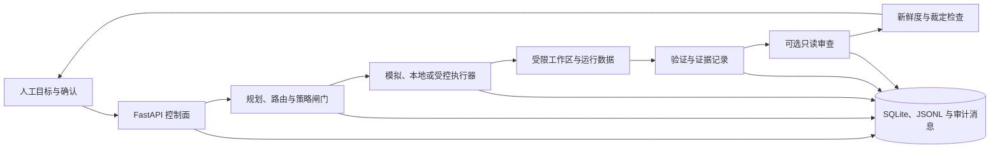

# AI-Dev-Orchestrator

一个面向证据驱动 AI 软件工程工作流的早期开源编排系统。

[English](README.md) | [简体中文](README.zh-CN.md)

> **状态：Early-stage / Maintainer Preview / Experimental**
>
> 仓库已经包含较完整的本地控制面，以及持续扩展的受控执行与审查合同；
> 但它尚未达到生产加固状态，完整测试基线当前并非全绿，部分真实执行器链路
> 仍属于 controlled smoke 或部分接入。

## 项目是什么

AI-Dev-Orchestrator 探索如何把编码智能体工作流做成可检查、可约束的过程，
而不是把一次智能体调用当作不可见的单步操作。它面向研究或维护本地 AI 辅助
研发流程的维护者与贡献者，重点关注审查闸门、人工确认、证据记录和受控工具执行。

普通编码智能体封装通常只负责把 Prompt 转发给模型或 CLI。本项目在调用前后建模
任务规划与路由、执行前置条件、工作区边界、验证证据、只读审查合同、裁定新鲜度
检查、审计记录和人工升级。这些机制只能降低风险，不能让生成改动天然安全。

## 要解决的问题

编码智能体可能读取不可信仓库、执行 Shell 命令、修改文件、调用外部 Provider，
也可能生成看似合理但实际错误的审查结论。如果没有明确边界，就很难回答：

- 智能体当时被允许做什么；
- 一个决定基于哪些证据；
- 审查结论是否仍对应当前 diff；
- 高风险转换何时由人确认；
- 运行失败后系统记录了什么。

本仓库把这些问题作为领域模型和服务层的一等对象。

## 当前能力

以下能力可以在当前代码和测试中找到证据，限定词同样属于能力说明的一部分。

- **本地编排控制面：** FastAPI 后端与 React/Vite 前端，覆盖项目、任务、运行、
  审批、交付件、成本、Agent Session 和仓库工作流。
- **任务执行与验证：** 支持模拟执行、本地命令执行、验证模板、预算与重试守卫、
  结构化运行日志和 SQLite 状态持久化。
- **Provider 抽象：** 包含 mock 与 OpenAI-compatible Provider 服务、可配置端点和
  脱敏配置摘要。真实调用需要操作者提供凭据，本轮没有验证所有兼容 Provider。
- **受控外部执行器合同：** 包含 preflight、launch、supervisor、readback、超时和
  清理组件。Native executor 仍属实验能力，常通过 dry-run 或 controlled smoke
  验证，不应视为无人值守生产运行时。
- **面向沙箱的工作区控制：** 包含后端固定根目录、名称规范化、路径包含检查、
  operation manifest、候选文件写入和 diff 生成。这些是增量守卫阶段，不是经过
  形式化验证的安全沙箱。
- **只读审查阶段：** 部分 AI Project Director 链路包含 dry-run、fake review、
  native 和 Codex app-server transport 合同；并非所有执行路径都会自动进入独立审查。
- **基于证据的闸门：** 部分审查与裁定链路使用哈希、来源绑定、schema 校验、
  追加式消息和新鲜度重验，拒绝不匹配、过期或已经消费的证据。
- **人工确认与升级：** 后端和控制面包含审批记录、显式确认字段、阻塞原因与升级状态。
- **审计型记录：** 包含任务/运行历史、JSONL 日志、Agent Message，以及运行、交付、
  调度、工作区生命周期和失败恢复事件服务。

详细边界见[项目状态](docs/PROJECT_STATUS.md)和[威胁模型](docs/THREAT_MODEL.md)。

## 工作流



并非每条路由都会经过所有阶段。真实外部执行、沙箱候选写入和只读 reviewer
transport 都需要特定前置条件，当前仍为实验能力。

## 安全与信任模型

系统默认仓库内容、Issue、Prompt、生成补丁、Provider 响应和执行器输出都可能不可信。
现有控制主要依靠阶段分离、显式允许/禁止字段、路径包含校验、证据绑定、裁定新鲜度、
人工确认、超时和结果留痕。

这些是纵深防御手段，不构成形式化安全保证。以当前用户身份启动的进程仍可能拥有该用户
的文件系统和网络权限。启用外部 Provider 或 Native executor 前，请阅读
[SECURITY.md](SECURITY.md)，限制凭据权限，并人工审查命令和补丁。

## 架构与目录

| 区域 | 路径 | 职责 |
| --- | --- | --- |
| API 与应用入口 | `runtime/orchestrator/app/api`、`app/main.py` | FastAPI 路由、合同和依赖装配 |
| 领域与持久化 | `app/domain`、`app/repositories`、`app/core` | 领域模型、SQLite、仓储和配置 |
| 编排服务 | `app/services` | 规划、闸门、证据、审查、审批、审计和 Provider |
| Worker 与执行器 | `app/workers`、`app/external_executors` | 任务推进和受控执行器接入 |
| Web 控制面 | `apps/web/src` | React 页面及后端 API adapter |
| 测试与 smoke | `runtime/orchestrator/tests`、`runtime/orchestrator/scripts`、`apps/web/scripts` | 合同、API、smoke 与 UI 结构验证 |
| 文档 | `docs` | 公开状态、威胁模型、产品记录、版本计划和历史归档 |

## 快速开始

项目尚未作为稳定软件包发布，也没有单条生产部署命令。已验证的开发方式是分别运行
后端和前端。

### 前置条件

- Git
- Python 3.11-3.13（后端声明 `>=3.11,<3.14`）
- [uv](https://docs.astral.sh/uv/)
- 与 `apps/web/package-lock.json` 兼容的 Node.js 与 npm

### 1. 克隆仓库

```bash
git clone https://github.com/kkyyds-hub/AI-Dev-Orchestrator.git
cd AI-Dev-Orchestrator
```

### 2. 启动后端

```bash
cd runtime/orchestrator
RUNTIME_DATA_DIR="$(mktemp -d)" uv run --no-project --with-editable . \
  python -m uvicorn app.main:app --host 127.0.0.1 --port 8011
```

在另一个终端检查：

```bash
curl --fail http://127.0.0.1:8011/health
```

API 文档位于 `http://127.0.0.1:8011/docs`。

### 3. 启动前端

```bash
cd apps/web
npm ci
VITE_BACKEND_URL=http://127.0.0.1:8011 npm run dev
```

Vite 会启动本地页面，并把 API 请求代理到 `http://127.0.0.1:8011`。
仓库中的 Vite 默认代理端口仍为 `8000`；这里显式覆盖端口，以便常用端口被占用时
仍可直接执行示例。

### 4. 运行隔离后端 smoke

```bash
cd runtime/orchestrator
uv run --no-project --with-editable . \
  python scripts/p9_run_backend_runnable_smoke.py --json
```

该 smoke 使用临时运行目录和模拟执行，不启动 Codex/Claude，不调用外部 Provider，
也不执行产品运行时 Git 写入。

## 配置

配置入口为 `runtime/orchestrator/app/core/config.py`。

| 环境变量 | 用途 | 默认值或行为 |
| --- | --- | --- |
| `RUNTIME_DATA_DIR` | 运行状态、日志与 Provider 配置 | `runtime/orchestrator/data` |
| `SQLITE_DB_DIR` / `SQLITE_DB_PATH` | SQLite 路径覆盖 | 位于运行数据目录下 |
| `REPOSITORY_WORKSPACE_ROOT_DIR` | 仓库/工作区服务根目录 | 仓库根目录 |
| `DAILY_BUDGET_USD` | 每日估算成本守卫 | `0.05` |
| `SESSION_BUDGET_USD` | 会话估算成本守卫 | `0.2` |
| `MAX_TASK_RETRIES` | 单任务重试守卫 | `2` |
| `MAX_CONCURRENT_WORKERS` | 本地 Worker 并发设置 | `2` |
| `OPENAI_API_KEY` | OpenAI-compatible Provider 凭据 | 未设置 |
| `OPENAI_BASE_URL` | OpenAI-compatible 端点 | `https://api.openai.com/v1` |
| `OPENAI_TIMEOUT_SECONDS` | Provider 请求超时 | `120` |
| `READONLY_REVIEWER_TIMEOUT_SECONDS` | Reviewer transport 超时 | `180` |
| `READONLY_REVIEWER_MAX_OUTPUT_BYTES` | Reviewer 最大输出 | `262144` |

不要提交凭据。Provider 设置也可以持久化在运行数据目录中，其中可能包含 API key；
应保护该文件，并优先使用可丢弃的开发环境和最小权限凭据。

## 示例开发流程

1. 通过 API 或 Web 控制面创建、规划任务。
2. 检查依赖、风险、人工状态和任务元数据。
3. 优先使用模拟执行，并配置验证模板或命令。
4. 检查 Run、结构化日志、验证结果和证据。
5. 在支持的 Project Director 链路中准备受限工作区和 diff，再请求只读审查。
6. 消费裁定前确认 reviewer 指纹和来源 diff 仍然新鲜。
7. 将模糊或高风险结果升级给人工，不把 Agent 结论直接当作合并授权。

## 当前限制

- 本仓库是维护者预览版本，不是受支持的生产服务。
- 当前 `main` 完整后端 pytest 基线为 3,462 通过、10 失败；失败包含旧 Provider smoke
  合同、遗留执行器边界断言和两项 Worker 流程预期。详见[项目状态](docs/PROJECT_STATUS.md)。
- 当前前端锁文件的 `npm audit` 报告 8 项（1 low、2 moderate、5 high）；仅生产依赖
  视图仍有 3 项 high。依赖修复需要单独进行兼容性审查，本轮不自动升级版本。
- 仓库没有已提交的 CI、发布自动化或公开软件包。
- 身份认证、授权、多租户和加固后的远程部署尚不是已证明能力。
- Native executor 和 reviewer 依赖本地工具与显式开关，许多测试使用 fake、dry-run
  或 controlled smoke。
- 工作区路径包含校验属于应用层控制，不等同于操作系统或容器隔离。
- Provider 兼容性和模型可用性取决于外部服务与操作者配置。
- 一些历史文档使用内部阶段编号，可能不代表当前公开状态。

## Roadmap

近期方向见[开放源码 Backlog](docs/OPEN_SOURCE_BACKLOG.md)，包括可复现安装、CI、E2E、
Provider 文档、威胁模型验证、沙箱加固、可观测性和发布自动化。Roadmap 项不是已完成功能。

## 贡献与安全报告

贡献前请阅读 [CONTRIBUTING.md](CONTRIBUTING.md)。改动应保留安全边界，并诚实标注
未完成或实验行为。

安全问题请阅读 [SECURITY.md](SECURITY.md)。不要在公开 Issue 中披露凭据、利用细节、
沙箱逃逸或其他可操作漏洞。仓库当前没有已验证的私密报告通道；在更广泛的安全敏感使用
前，维护者仍需启用 GitHub private vulnerability reporting。

## 许可证

本项目使用 [Apache License 2.0](LICENSE)。
