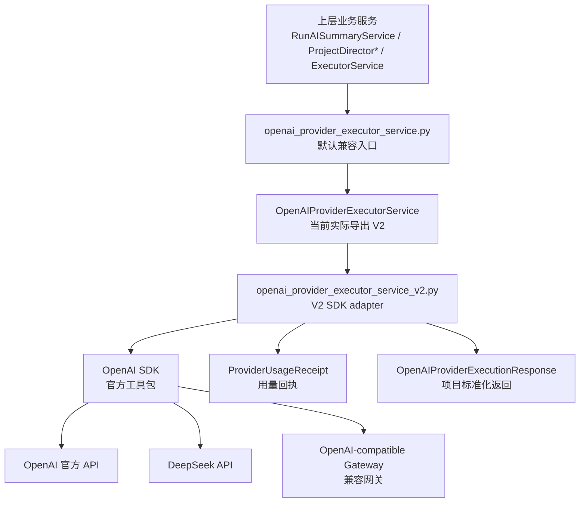
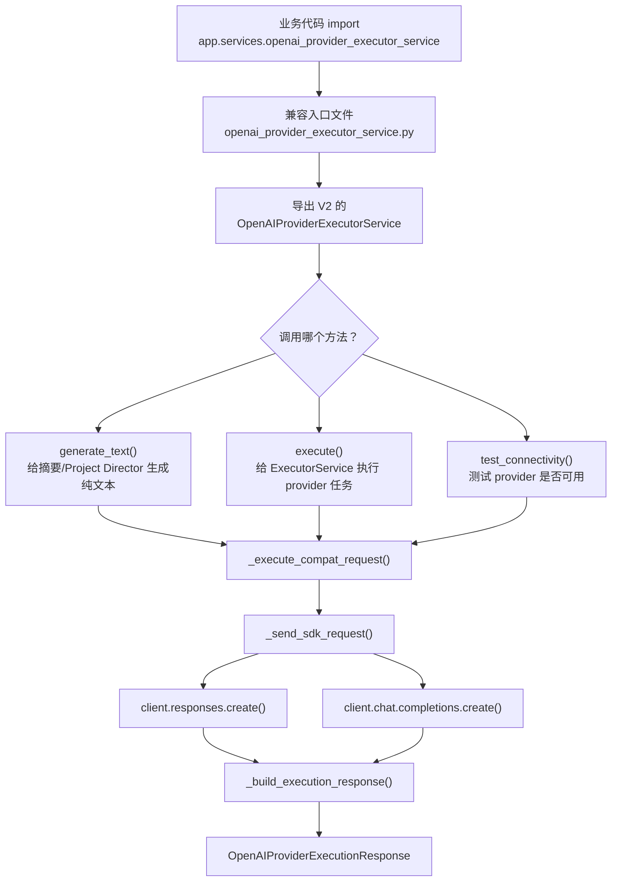
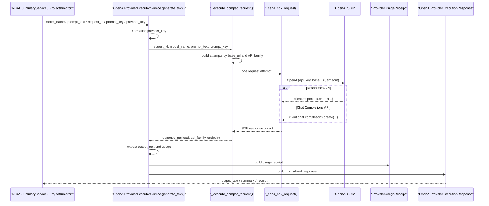
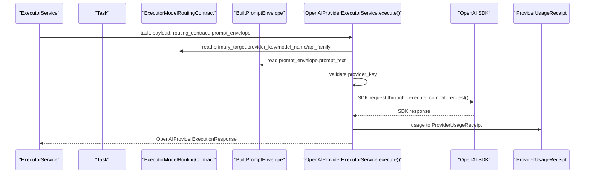
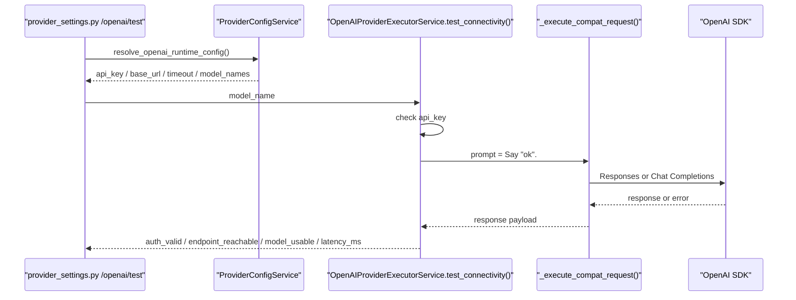
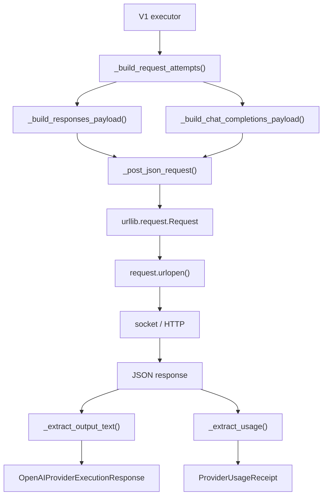
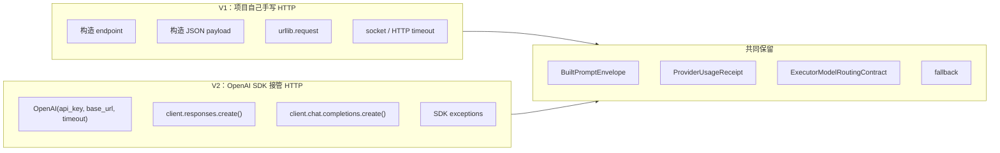
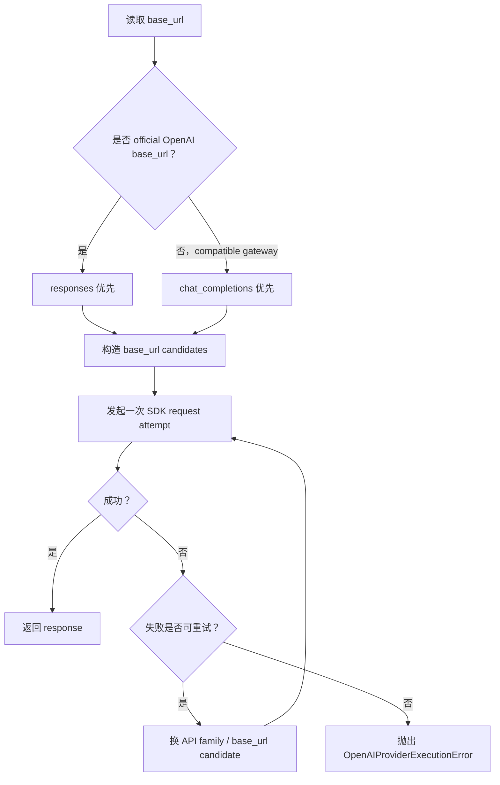

# OpenAI Provider Executor V1/V2 调用链学习文档

## 1. 这份文档解决什么问题

这份文档解释 AI-Dev-Orchestrator 里“调用大模型”的完整工作原理。它不是 OpenAI 的通用教程，而是结合当前项目真实代码路径、真实类名、真实函数名来讲清楚：

- 为什么你只学了 `from openai import OpenAI`，项目里却有 `OpenAIProviderExecutorService`、`BuiltPromptEnvelope`、`ProviderUsageReceipt`、`ExecutorModelRoutingContract` 这些层。
- P21-B1 之后，项目为什么默认走 V2，也就是 `runtime/orchestrator/app/services/openai_provider_executor_service_v2.py`。
- P21-B1-R1 之后，V1 原始实现为什么被归档到 `runtime/orchestrator/app/services/openai_provider_executor_service_v1.py`。
- V1 手写 HTTP 请求和 V2 使用 OpenAI SDK（官方工具包）的区别。
- 上层业务服务，例如 Run AI Summary 和 Project Director，是怎么把 prompt（提示词）交给 executor（执行器）再拿回结果的。

文档里的术语第一次出现会带中文解释。后面再次出现时，为了方便阅读，会直接使用术语。

## 2. 先用一句话看懂当前架构

当前架构一句话是：

> 上层业务服务不直接写 `client = OpenAI()`，而是统一调用 `openai_provider_executor_service.py` 这个默认入口；这个入口现在导出 V2 adapter（适配器），V2 再用 OpenAI SDK 调 OpenAI / DeepSeek / OpenAI-compatible gateway（兼容网关），最后把 SDK 原始响应标准化成项目自己的 `OpenAIProviderExecutionResponse` 和 `ProviderUsageReceipt`。

这里的 adapter（适配器）可以理解为“翻译层”：项目内部有自己的数据结构，OpenAI SDK 也有自己的请求/响应结构，adapter 负责在两边之间转换。

## 3. 当前三个核心文件分别是什么

当前和 OpenAI provider executor 最直接相关的是三个文件：

| 文件 | 当前作用 | 是否默认运行入口 |
|---|---|---|
| `runtime/orchestrator/app/services/openai_provider_executor_service.py` | 兼容入口。保留老 import 路径，但当前从 V2 文件导出类。 | 是，业务代码仍从这里 import |
| `runtime/orchestrator/app/services/openai_provider_executor_service_v1.py` | V1 原始实现归档。保留手写 `urllib` / `socket` / HTTP 请求逻辑，用来学习和对照。 | 否 |
| `runtime/orchestrator/app/services/openai_provider_executor_service_v2.py` | V2 官方 OpenAI SDK 同步适配器。实际默认使用的实现。 | 是，被兼容入口导出 |

默认入口 `openai_provider_executor_service.py` 的关键导入是：

```python
from app.services.openai_provider_executor_service_v2 import (
    OpenAIProviderExecutionError,
    OpenAIProviderExecutionResponse,
    OpenAIProviderExecutorService,
)
```

所以现在这句：

```python
from app.services.openai_provider_executor_service import OpenAIProviderExecutorService
```

拿到的是 V2，不是 V1。

## 4. 从最简单的 OpenAI 调用理解项目版调用

你刚学会的最小 OpenAI SDK 调用大概像这样：

```python
from openai import OpenAI

client = OpenAI(api_key="你的 key")
response = client.chat.completions.create(
    model="gpt-4.1-mini",
    messages=[{"role": "user", "content": "你好"}],
)
print(response.choices[0].message.content)
```

这段代码适合学习 SDK 的基础用法，但项目不能只这样写，原因是项目还需要处理更多事情：

- API key（接口密钥）从哪里来：环境变量还是页面保存的 provider 设置。
- base_url（接口基础地址）是什么：官方 OpenAI、DeepSeek，还是 OpenAI-compatible gateway。
- model_name（模型名）怎么选：不同角色、不同策略、不同层级会选择不同模型。
- prompt（提示词）是谁构建的：不是每个业务随手拼字符串，而是通过项目内部 prompt contract（契约）统一表达。
- token usage（token 用量）怎么记录：需要保存 prompt_tokens、completion_tokens、total_tokens、缓存命中等信息。
- fallback（回退）怎么做：某个 API family（接口类型族）失败后，要不要换另一个 API family 或 base_url candidate。
- observability（可观测性）怎么做：日志、回执 ID、错误分类、延迟 latency（延迟）等需要统一。

所以项目版调用不是把简单示例复杂化，而是把真实产品里必须面对的问题集中到 executor adapter 里处理。

## 5. 项目 LLM 调用总览图



这张图的重点是：上层业务服务不直接面对 OpenAI SDK。上层只面对项目自己的 executor。这样做的好处是所有业务都能共享同一套 API key、base_url、fallback、usage 解析和错误分类逻辑。

输入是什么：上层传入 `model_name`、`prompt_text` 或者 `Task + ExecutorModelRoutingContract + BuiltPromptEnvelope`。  
中间发生什么：默认入口把调用导到 V2，V2 用 SDK 发请求并解析结果。  
输出是什么：项目自己的 `OpenAIProviderExecutionResponse`，里面可以带 `ProviderUsageReceipt`。

## 6. 当前默认 V2 调用链总图



这张图说明 V2 的三个公开方法最终都会进入 `_execute_compat_request()`，再由 `_send_sdk_request()` 调用 OpenAI SDK。区别在于：

- `generate_text()` 直接接收 `prompt_text`。
- `execute()` 从 `BuiltPromptEnvelope.prompt_text` 读取最终 prompt。
- `test_connectivity()` 构造一个最小 prompt：`Say "ok".`，用来检查 key、endpoint、model 是否可用。

## 7. V2 generate_text() 详细调用链

`generate_text()` 主要给 Run AI Summary 和 Project Director 这类“给我生成一段文本”的场景使用。



步骤编号：

1. 上层服务准备 `model_name` / `prompt_text` / `request_id` / `prompt_key` / `provider_key`。
2. 上层调用 `OpenAIProviderExecutorService.generate_text()`。
3. V2 用 `_normalize_provider_key()` 规范化 `provider_key`，例如把大小写和空格处理掉。
4. `generate_text()` 调用 `_execute_compat_request()`。
5. `_execute_compat_request()` 根据 `base_url` 和 `preferred_api_family` 构造 attempts（请求尝试列表）。
6. 每个 attempt 调用 `_send_sdk_request()`。
7. `_send_sdk_request()` 创建 `OpenAI(api_key=self.api_key, base_url=attempt.api_base_url, timeout=self.timeout_seconds)`。
8. 根据 API family 调 `client.responses.create()` 或 `client.chat.completions.create()`。
9. 成功后通过 `_extract_output_text()` 提取 `output_text`。
10. 通过 `_extract_usage()` 提取 usage（用量）。
11. 通过 `_build_execution_response()` 构造 `ProviderUsageReceipt`。
12. 构造 `OpenAIProviderExecutionResponse` 返回给上层。

输入是什么：

- `model_name`：要用的模型，例如 `gpt-4.1-mini`、`deepseek-v4-pro`。
- `prompt_text`：最终发给模型的提示词文本。
- `request_id`：请求 ID，方便追踪。
- `prompt_key`：提示词类型，例如 `run_ai_summary`、`project_director_chat_response`。
- `provider_key`：provider 类型，例如 `openai`、`deepseek`、`openai_compatible`。

输出是什么：

- `OpenAIProviderExecutionResponse.output_text`：模型生成文本。
- `OpenAIProviderExecutionResponse.provider_usage_receipt`：模型调用用量回执。
- `OpenAIProviderExecutionResponse.summary`：中文或结构化摘要，方便日志和上层展示。

## 8. V2 execute() 详细调用链

`execute()` 主要给 `ExecutorService` 的 provider 模式使用。它比 `generate_text()` 多了 `Task`、`ExecutorModelRoutingContract`、`BuiltPromptEnvelope`。



步骤编号：

1. `ExecutorService` / worker 传入 `Task`、`payload`、`routing_contract`、`prompt_envelope`。
2. `execute()` 从 `routing_contract.primary_target` 读取 `provider_key` / `model_name` / `api_family`。
3. `execute()` 从 `prompt_envelope.prompt_text` 读取最终 prompt。
4. `execute()` 校验 `provider_key` 是否属于 `openai`、`deepseek`、`openai_compatible`。
5. `execute()` 调用 `_execute_compat_request()`。
6. `_send_sdk_request()` 发起 SDK 请求。
7. `_extract_usage()` 和 `_build_execution_response()` 把 usage 转成 `ProviderUsageReceipt`。
8. 返回 `OpenAIProviderExecutionResponse` 给 `ExecutorService`。

特别注意：`payload` 当前不是最终发给模型的主要内容。真正发给模型的是 `prompt_envelope.prompt_text`。`payload` 仍然保留在方法签名里，是为了和 `ExecutorService` 的旧执行模式兼容，也方便 fallback 或日志语义延续。

输入是什么：

- `Task`：任务对象，带 `id`、`title`、`input_summary` 等信息。
- `ExecutorModelRoutingContract`：模型路由合同，决定 provider、model 和 API family。
- `BuiltPromptEnvelope`：项目内部已经构建好的 prompt 容器，最终文本在 `prompt_text`。

输出是什么：

- `OpenAIProviderExecutionResponse`，再由 `ExecutorService` 包装成 `ExecutionResult`。

## 9. V2 test_connectivity() 详细调用链

`test_connectivity()` 用于 provider 设置页面或 API 测试，检查当前配置是否可用。



步骤编号：

1. 检查 `api_key` 是否存在。
2. 构造最小 prompt：`Say "ok".`
3. 调用 `_execute_compat_request()`。
4. 用 `time.perf_counter()` 计算 `latency_ms`，也就是从请求开始到拿到结果的延迟毫秒数。
5. 成功时返回 `auth_valid` / `endpoint_reachable` / `model_usable`。
6. 失败时返回 `error_category` / `error_summary`。

输入是什么：当前 provider runtime config 里的 `api_key`、`base_url`、`timeout_seconds` 和 balanced 模型名。  
输出是什么：结构化 dict，最后在 `runtime/orchestrator/app/api/routes/provider_settings.py` 里变成 `OpenAIProviderTestResponse`。

## 10. V1 调用链：原来如何手写 urllib/socket 请求

V1 归档在 `runtime/orchestrator/app/services/openai_provider_executor_service_v1.py`。它的学习价值是让你看懂 SDK 背后大概发生了什么：拼 endpoint、拼 JSON payload、加 Authorization header、发 HTTP POST、读 JSON、处理 HTTPError / URLError / timeout。



图下面的解释：

- `_build_request_attempts()` 决定尝试哪些 endpoint。
- `_build_responses_payload()` 和 `_build_chat_completions_payload()` 手动拼 OpenAI 请求 body。
- `_post_json_request()` 手动创建 `request.Request`，设置 `Authorization: Bearer ...`、`Content-Type`、`User-Agent`。
- `request.urlopen()` 真正发 HTTP 请求。
- `socket.timeout` 这类底层超时也要自己捕获。
- `_extract_output_text()` 和 `_extract_usage()` 从 dict 结构里手动读字段。

V1 不是当前默认入口，但它适合学习“如果不用 SDK，程序要自己做多少网络细节”。

## 11. V1 和 V2 的核心区别



| 维度 | V1 | V2 | 对初学者的理解 |
|---|---|---|---|
| 底层请求方式 | 手写 `urllib.request` 和 `socket` 处理 | 使用 OpenAI SDK | V1 像自己造车轮，V2 像用官方轮子 |
| 依赖 | Python 标准库为主 | `openai>=2.0,<3.0` | V2 需要官方 SDK 包 |
| 网络错误处理 | 自己捕获 `HTTPError`、`URLError`、`socket.timeout` | 捕获 `APIConnectionError`、`APIStatusError` 等 SDK 异常 | SDK 把很多底层错误封装成更清晰的类型 |
| Responses API 支持 | 支持，手写 payload | 支持，调用 `client.responses.create()` | V2 更接近官方推荐方式 |
| Chat Completions API 支持 | 支持，手写 messages payload | 支持，调用 `client.chat.completions.create()` | 兼容旧式聊天补全接口 |
| base_url 兼容 | 自己构造候选 endpoint | SDK base_url + 项目候选策略 | 两者都保留兼容网关能力 |
| usage 解析 | 从 JSON dict 读 `usage` | 从 SDK object / dict 读 `usage` | 都要转成项目自己的回执 |
| fallback | 手写失败分类后换 endpoint/API family | SDK 异常映射后换 API family/base_url candidate | fallback 是项目层能力，不是 SDK 自动完成 |
| 可维护性 | 网络细节多，维护成本高 | 网络细节交给 SDK，项目代码更集中 | V2 更适合后续扩展 |
| 学习价值 | 适合理解 HTTP 底层 | 适合理解工程化接入 | 两份都值得读 |
| 风险 | 容易漏掉兼容细节和异常细节 | 依赖 SDK 行为和版本 | V2 风险更可控 |
| 是否支持 streaming | 不支持 | 不支持 | 当前没有流式输出 |
| 是否支持 AsyncOpenAI | 不支持 | 不支持 | 当前仍是同步调用 |
| 是否执行 tool calling | 不执行 | 不执行，只识别/预留 | 模型提出工具调用不等于程序已经执行工具 |

重点结论：

- V1 的价值是学习 HTTP 调用模型的底层细节。
- V2 的价值是减少手写网络代码，使用官方 SDK，更适合后续扩展。
- 当前 V2 仍然没有做 streaming（流式输出）。
- 当前 V2 仍然没有做 AsyncOpenAI（异步 OpenAI 客户端）。
- 当前 V2 仍然没有真正执行 tool calling（工具调用）。

## 12. BuiltPromptEnvelope 到底是什么

`BuiltPromptEnvelope` 定义在 `runtime/orchestrator/app/domain/prompt_contract.py`。

它不是 OpenAI SDK 的 `messages`。它是项目内部“已经构建好的提示词信封 / prompt 容器”。

它解决的问题是：上层服务在不同阶段会收集任务、上下文、策略、验收标准等信息。如果每个地方都直接拼 OpenAI `messages`，以后很难统一审计和复用。`BuiltPromptEnvelope` 把“项目内部 prompt 已经准备好”这件事表达成一个稳定对象。

核心字段：

| 字段 | 含义 | 初学者理解 |
|---|---|---|
| `template_ref` | prompt 模板引用，包含 `prompt_key` 和版本 | 这段 prompt 属于哪类模板 |
| `render_mode` | 渲染模式，例如 execution / verification | 这段 prompt 用于执行还是验证 |
| `provider_key` | 建议使用的 provider | 可为空，不一定最终决定 |
| `model_name` | 建议使用的模型 | 可为空，不一定最终决定 |
| `sections` | 分段后的 prompt 内容 | 像文章小节 |
| `prompt_text` | 最终发给模型的完整文本 | V2 真正读取并发送的内容 |
| `prompt_char_count` | prompt 字符数 | 用于日志和观测 |

它从哪里来：由 prompt 构建链路生成。  
它往哪里传：传给 `ExecutorService.execute_task()`，再传给 `OpenAIProviderExecutorService.execute()`。  
初学者可以这样理解：它不是“OpenAI 请求体”，而是“项目内部确认好的最终提示词包裹”。

## 13. ExecutorModelRoutingContract 到底是什么

`ExecutorModelRoutingContract` 定义在 `runtime/orchestrator/app/domain/model_policy.py`。

它是“执行器模型路由合同”。contract（契约）在这里的意思是：上游策略已经把“应该怎么执行、用哪个 provider、用哪个模型、首选哪个 API family”写成一个稳定结构，下游 executor 按这个结构执行。

它决定：

- 当前走 provider 还是 simulate。
- 用哪个 provider，例如 `openai`、`deepseek`、`openai_compatible`。
- 用哪个 model，例如 `gpt-5.5`、`deepseek-v4-pro`。
- 首选哪个 API family，例如 `responses` 或 `chat_completions`。
- 隐式 fallback 策略，例如 provider 不可用时回退到 simulate。

关键结构：

- `primary_mode`：主要执行模式，常见是 `ExecutorRouteMode.PROVIDER`。
- `primary_target`：包含 `provider_key`、`model_name`、`api_family`。
- `implicit_fallback_mode`：隐式回退模式。
- `route_reason`：为什么这样路由。
- `strategy_hint`：策略解释信息。

它从哪里来：模型路由/策略链路生成。  
它往哪里传：传给 `ExecutorService`，再传给 V2 的 `execute()`。  
初学者可以这样理解：它像“派单单据”，告诉 executor 这次要找哪个模型服务干活。

## 14. ProviderUsageReceipt 到底是什么

`ProviderUsageReceipt` 定义在 `runtime/orchestrator/app/domain/prompt_contract.py`。

它是“模型调用用量回执”。receipt（回执）在这里的意思是：模型服务返回后，项目把这次调用用了多少 token、哪个模型、哪个回执 ID 等信息整理成一张标准收据。

它记录：

- `provider_key`
- `model_name`
- `receipt_id`
- `receipt_source`
- `prompt_tokens`
- `completion_tokens`
- `total_tokens`
- `estimated_cost_usd`
- `pricing_source`
- `cache_read_tokens`
- `cache_write_tokens`
- `cache_hit`
- `cache_source`

它解决的问题是：OpenAI、DeepSeek、兼容网关返回 usage 字段可能不完全一样，但项目上层不能每次都理解不同格式。V2 通过 `_extract_usage()` 先提取，再通过 `_build_execution_response()` 生成统一的 `ProviderUsageReceipt`。

它从哪里来：从 SDK response 的 `usage` 字段解析而来。  
它往哪里传：放进 `OpenAIProviderExecutionResponse.provider_usage_receipt`，再由上层记录到 run、summary 或日志。  
初学者可以这样理解：它像一次模型调用的小票。

## 15. ProviderConfigService 如何提供 API key / base_url / model

`ProviderConfigService` 在 `runtime/orchestrator/app/services/provider_config_service.py`。

它解决的问题是：真实调用模型必须知道 API key、base_url、timeout、model preset 和 model names，但这些配置可能来自两个地方：

1. 保存到 runtime data 的 provider config 文件。
2. 环境变量，例如 `settings.openai_api_key`、`settings.openai_base_url`。

`resolve_openai_runtime_config()` 会返回 `OpenAIProviderRuntimeConfig`，里面包含：

- `api_key`
- `base_url`
- `timeout_seconds`
- `source`
- `detected_provider_type`
- `model_preset`
- `model_names`

`detect_provider_type()` 会根据 base_url 判断 provider 类型：

- 包含 `deepseek.com` 或 `deepseek`：`deepseek`
- 官方 OpenAI host：`openai`
- 其他：`openai_compatible`

它从哪里来：provider settings API 或环境变量。  
它往哪里传：传给 `OpenAIProviderExecutorService(api_key=..., base_url=..., timeout_seconds=...)`。  
初学者可以这样理解：它是“模型服务配置读取器”，业务服务不应该自己到处找 key。

## 16. Responses API 和 Chat Completions API 是什么关系

API family（接口类型族）是项目对 OpenAI 不同接口风格的叫法。

Responses API（OpenAI 新一代响应接口）在 V2 里对应：

```python
client.responses.create(...)
```

Chat Completions API（聊天补全接口）在 V2 里对应：

```python
client.chat.completions.create(...)
```

二者都能让模型生成文本，但请求结构不同：

- Responses API 使用 `input`，项目通过 `_build_responses_kwargs()` 构造。
- Chat Completions API 使用 `messages`，项目通过 `_build_chat_completions_kwargs()` 构造。

项目为什么同时支持两种：

- 官方 OpenAI 新接口优先走 Responses API。
- 很多兼容网关、DeepSeek 或旧服务更稳定支持 Chat Completions API。
- 保留两种可以提高兼容性。

## 17. compatible gateway fallback 是怎么工作的

compatible gateway fallback 指：当某个兼容网关不支持当前 API family 或某个 base_url 形式时，项目会尝试另一个 API family 或 base_url candidate，而不是立刻失败。



V2 里的关键函数：

- `_api_family_order()`：决定 API family 顺序。
- `_build_api_base_candidates()`：构造 base_url 候选。
- `_build_request_attempts()`：组合 API family 和 base_url。
- `_is_retriable_compat_error()`：判断失败是否允许尝试下一条路径。

官方 OpenAI base_url 默认 Responses 优先。  
DeepSeek / OpenAI-compatible gateway 默认 Chat Completions 优先。  
失败且属于可重试兼容错误时，才换下一条 attempt，不会无限重试。

## 18. SDK 异常如何变成项目内部错误

V2 捕获 OpenAI SDK 的异常，然后通过 `_map_openai_error()` 转成项目自己的 `OpenAIProviderExecutionError`。

OpenAI SDK 异常包括：

- `AuthenticationError`：认证错误，例如 API key 无效。
- `RateLimitError`：限流错误。
- `BadRequestError`：请求参数错误。
- `APIConnectionError`：网络连接错误。
- `APIStatusError`：服务返回非 2xx 状态码。
- `APIError`：其他 SDK API 错误。

项目内部错误 `OpenAIProviderExecutionError` 会带：

- `category`
- `message`
- `status_code`
- `api_family`
- `endpoint`

这样上层不用知道 SDK 异常细节，只看项目稳定分类，例如：

- `auth_error`
- `rate_limited`
- `bad_request`
- `network_error`
- `endpoint_not_found`
- `upstream_retryable`
- `api_error`
- `request_error`

## 19. tool calling 当前只是怎么预留的

tool calling（工具调用）不是模型自己真的执行工具。它的真实过程通常是：

1. 模型返回“我想调用某个工具，并给出参数”。
2. 程序读取这个请求。
3. 程序自己执行工具，例如查数据库、读文件、调用 API。
4. 程序把工具结果再发回模型。
5. 模型基于工具结果继续回答。

当前 V2 没有做这个闭环。它只做最小预留：

- `_send_sdk_request()` 接收 `tools: list[dict[str, Any]] | None`。
- `_build_responses_kwargs()` 和 `_build_chat_completions_kwargs()` 如果 `tools` 不为空，会传给 SDK。
- `_extract_tool_call_summary()` 能识别模型提出了 tool calls，并生成提示 summary。

当前不会：

- 注册真实工具。
- 执行 shell / 文件系统 / GitHub 工具。
- 做 tool call -> execute tool -> second model call 的循环。

## 20. 上层业务：Run AI Summary 是怎么调用 LLM 的

Run AI Summary 的服务在 `runtime/orchestrator/app/services/run_ai_summary_service.py`。

调用链简化如下：

1. `generate_run_summary()` 构造 `RunAISummaryContext`。
2. `_can_try_ai()` 判断 provider 是否可用。
3. `_try_ai_summary()` 构造 AI prompt。
4. `_call_provider_text()` 创建 `OpenAIProviderExecutorService`。
5. 调用 `executor.generate_text(...)`。
6. 取 `response.output_text` 或 `response.summary`。
7. 如果有 `provider_usage_receipt`，取 `receipt_id`。
8. 校验 Markdown 格式。
9. 保存 `RunAISummary`，其中 `source=AI`，`provider_receipt_id=receipt_id`。
10. 如果失败，回退到规则摘要 `RULE_FALLBACK`。

输入是什么：run、task、provider config、AI prompt。  
输出是什么：一条 `RunAISummary` 记录。  
中间发生什么：真实 LLM 调用失败时不会让摘要功能整体不可用，而是回退到规则摘要。

## 21. 上层业务：Project Director 是怎么调用 LLM 的

Project Director 相关服务有多个调用点：

- `runtime/orchestrator/app/services/project_director_service.py`
- `runtime/orchestrator/app/services/project_director_plan_service.py`
- `runtime/orchestrator/app/services/project_director_message_service.py`

典型共同模式是：

1. 通过 `ProviderConfigService.resolve_openai_runtime_config()` 读取 provider 配置。
2. 选择 model，例如 balanced 模型。
3. 构造 prompt_text。
4. 调用 `_call_provider_text()`。
5. `_call_provider_text()` 从默认入口 import `OpenAIProviderExecutorService`。
6. 创建 executor。
7. 调用 `generate_text()`。
8. 取 `output_text` 和 `provider_receipt_id`。
9. 上层再做 JSON 解析、guardrail 校验或业务落库。

不同服务的 `prompt_key` 不同：

- `project_director_clarification`
- `project_director_plan_generation`
- `project_director_chat_response`

这能帮助日志和回执区分“这次模型调用是为了澄清问题、生成计划，还是回复用户消息”。

## 22. 如果以后要做 streaming，会牵动哪些地方

streaming（流式输出）不是只给 SDK 加一个参数那么简单。它会牵动多层：

- V2 adapter：需要支持 SDK 的 stream 返回，逐段读取 delta。
- `OpenAIProviderExecutionResponse`：当前是一次性 `output_text`，流式可能需要新事件结构。
- 后端 API：可能需要 SSE（Server-Sent Events，服务端事件流）或 WebSocket（双向长连接）。
- 前端：需要逐段渲染，而不是等完整文本返回。
- 错误处理：流中途断开时，要能告诉用户已经收到多少、是否可重试。
- usage：有些 usage 可能在流结束时才返回，需要新的收口逻辑。

所以 P21-B1 没有直接做 streaming 是合理的：先把同步非流式调用链稳定下来，再扩展流式。

## 23. 如果以后要做 AsyncOpenAI，会牵动哪些地方

AsyncOpenAI（异步 OpenAI 客户端）也不只是替换一行 import。

如果使用 AsyncOpenAI：

- V2 方法可能要从普通 `def` 变成 `async def`。
- 上层 `generate_text()` 调用方要 `await`。
- FastAPI route、service、worker 的调用链要确认是否已经支持 async。
- 测试要改成异步测试。
- fallback 和异常处理也要在 async 链路里重新验证。

当前 V2 使用同步 `OpenAI`，这样对既有 `RunAISummaryService`、`ProjectDirector*`、`ExecutorService` 的影响最小。

## 24. 推荐阅读代码顺序

1. `runtime/orchestrator/app/services/openai_provider_executor_service.py`  
   先看默认入口，明确“业务 import 的不是 V1，而是 V2”。

2. `runtime/orchestrator/app/services/openai_provider_executor_service_v2.py` 的 `generate_text()`  
   这是最接近你已学 `OpenAI()` 示例的项目版纯文本调用。

3. `_execute_compat_request()`  
   看项目如何构造 attempts、如何做 fallback、如何处理失败。

4. `_send_sdk_request()`  
   看真正创建 `OpenAI(api_key, base_url, timeout)` 和调用 SDK 的地方。

5. `_build_responses_kwargs()`  
   看 Responses API 的请求参数怎么从项目 prompt 变成 SDK kwargs。

6. `_build_chat_completions_kwargs()`  
   看 Chat Completions API 的 messages 怎么构造。

7. `_extract_output_text()`  
   看项目如何从不同 API 响应里拿到最终文本。

8. `_extract_usage()`  
   看 usage、cache tokens、缺失字段降级如何处理。

9. `_build_execution_response()`  
   看如何把 SDK response 变成 `ProviderUsageReceipt` 和 `OpenAIProviderExecutionResponse`。

10. `runtime/orchestrator/app/services/provider_config_service.py`  
    看 API key、base_url、model preset 从哪里来。

11. `runtime/orchestrator/app/domain/prompt_contract.py`  
    看 `BuiltPromptEnvelope`、`ProviderUsageReceipt` 的字段定义。

12. `runtime/orchestrator/app/domain/model_policy.py`  
    看 `ExecutorModelRoutingContract` 怎么表达模型路由。

13. `runtime/orchestrator/app/services/run_ai_summary_service.py`  
    看一个真实业务如何调用 `generate_text()` 并保存回执。

14. `runtime/orchestrator/app/services/project_director_*` service  
    看 Project Director 如何用同一 executor 完成澄清、计划生成、对话回复。

15. `runtime/orchestrator/app/services/openai_provider_executor_service_v1.py`  
    最后看 V1，对比 SDK 出现前项目要自己手写多少 HTTP 细节。

## 25. 初学者 FAQ

### Q1：为什么我只学了 `from openai import OpenAI`，但项目里这么复杂？

因为真实项目不只要“问一次模型”。它还要管理 key、base_url、模型选择、prompt 契约、usage 回执、错误分类、fallback、日志和上层业务保存。`OpenAI()` 是底层调用工具，项目 executor 是工程化封装。

### Q2：为什么不直接在业务代码里写 `client = OpenAI()`？

如果每个业务都直接写，Run AI Summary、Project Director、ExecutorService 会各自处理 key、错误、usage 和 fallback，最后逻辑分散。统一 executor 可以让所有业务共用一套规则。

### Q3：为什么要有 `BuiltPromptEnvelope`？

因为项目 prompt 不只是一个随手写的字符串。它可能来自模板、上下文、路由策略、任务信息和验收标准。`BuiltPromptEnvelope` 把“已经构建好的 prompt”变成一个稳定对象。

### Q4：为什么要有 `ProviderUsageReceipt`？

因为项目需要知道一次模型调用用了多少 token、哪个模型、哪个 provider、回执 ID 是什么。它是后续成本统计、日志和问题排查的基础。

### Q5：为什么要同时支持 Responses 和 Chat Completions？

官方 OpenAI 推荐新一代 Responses API，但很多兼容网关和 DeepSeek 更常支持 Chat Completions API。两个都支持，项目就能兼容更多 provider。

### Q6：为什么 DeepSeek 也能用 OpenAI SDK？

因为 DeepSeek 提供 OpenAI-compatible API，也就是接口形状和 OpenAI 类似。只要设置正确的 `base_url` 和模型名，OpenAI SDK 可以把请求发到 DeepSeek 的兼容地址。

### Q7：为什么 V2 还要保留 fallback？

SDK 负责发请求，但不负责理解“这个项目应该先试哪个 API family，失败后要不要换一个”。fallback 是项目的兼容策略，不是 SDK 自动替你设计好的业务规则。

### Q8：为什么不现在就做流式输出？

流式输出会牵动后端事件流、前端逐段渲染、错误收口和 usage 收口。当前先稳定同步完整响应，更容易验证。

### Q9：为什么不现在就做 AsyncOpenAI？

AsyncOpenAI 会让调用链变成 async/await。上层 service、route、worker、测试都可能要跟着调整。P21-B1 的目标是替换底层 HTTP 实现，不是改全链路并发模型。

### Q10：以后如果我要加 streaming，应该从哪里开始？

先从 `openai_provider_executor_service_v2.py` 设计一个独立的 streaming 方法或 adapter 层开始，同时明确后端要用 SSE 还是 WebSocket，再设计前端如何消费增量文本。不要直接改现有 `generate_text()` 的返回契约。

## 26. 总结：这次 V2 改造真正改变了什么

P21-B1 真正改变的是：项目默认 OpenAI provider executor 从 V1 的手写 HTTP 请求，切换到 V2 的官方 OpenAI SDK 同步适配器。

它没有改变：

- 上层业务的默认 import 路径。
- `generate_text()` 的对外签名。
- `execute()` 的对外签名。
- `BuiltPromptEnvelope`、`ProviderUsageReceipt`、`ExecutorModelRoutingContract` 这些项目内部契约。
- 当前不做 streaming。
- 当前不做 AsyncOpenAI。
- 当前不执行 tool calling 闭环。

它改变了：

- 网络请求不再由项目手写 `urllib` / `socket`。
- Responses API 和 Chat Completions API 通过 SDK 调用。
- SDK 异常会被映射成项目内部 `OpenAIProviderExecutionError`。
- compatible gateway fallback 仍保留，但执行请求的底层工具变成 OpenAI SDK。
- V1 被归档，方便学习底层 HTTP 和必要时回滚参考。

对初学者最重要的理解是：`from openai import OpenAI` 是一块积木，而 AI-Dev-Orchestrator 的 provider executor 是把这块积木放进真实系统后的工程化结构。你可以先从最小 SDK 调用理解“怎么问模型”，再通过这份文档理解“项目为什么要这样问模型”。
