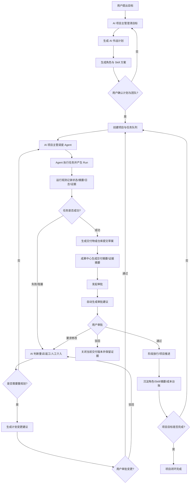
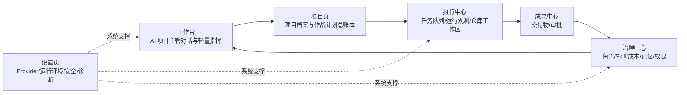
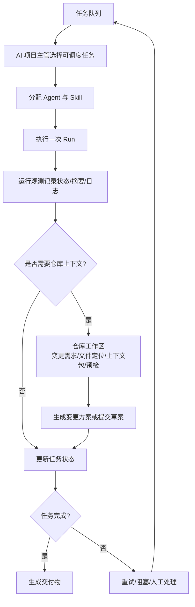
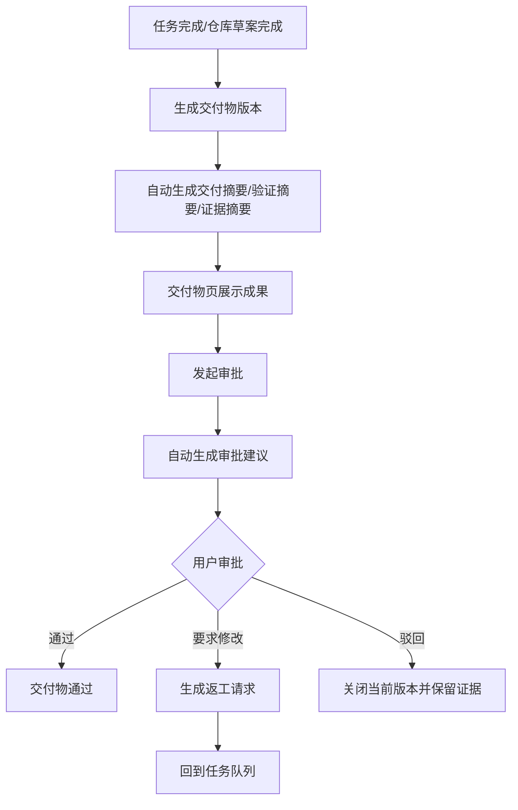
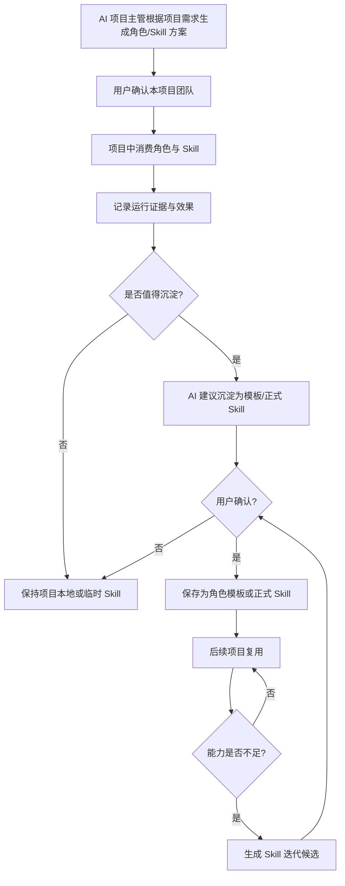
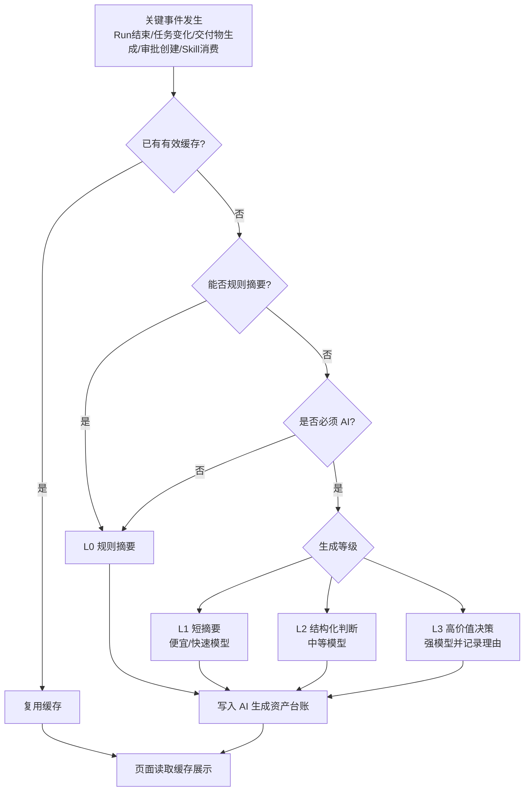
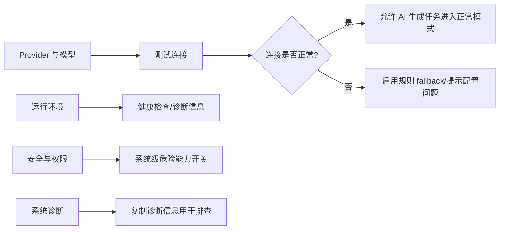

# AI-Dev-Orchestrator AI 项目主管闭环流程设计

> 文档日期：2026-05-18  
> 适用对象：AI-Dev-Orchestrator 产品信息架构、前端页面重构、后端闭环补齐、Codex 阶段任务拆分、阶段 Gate 验收。  
> 文档定位：本文件说明系统如何从“用户提出目标”到“AI 项目主管调度执行、交付审批、治理沉淀、成本受控”形成完整闭环。  
> 配套文档：`AI-Dev-Orchestrator-page-IA-final-workbench-project-execution-delivery-governance-settings-20260518.md`。

---

## 1. 文档目的

当前页面信息架构已经确定为：

```text
工作台 / 项目 / 执行中心 / 成果中心 / 治理 / 设置
```

页面职责清晰以后，还必须定义“项目什么时候才算闭环”。本文件用于回答以下问题：

1. 用户从提出目标开始，到项目结束，中间必须经过哪些节点。
2. AI 项目主管在每个节点负责什么。
3. 哪些动作可以自动执行，哪些动作必须用户确认。
4. 任务、运行、仓库、交付物、审批、治理之间如何形成证据链。
5. AI 摘要、成本、角色、Skill 如何在执行过程中顺手沉淀，避免重复生成。
6. 后续 Codex 执行任务时如何判断某一阶段是否是真闭环，而不是只做了 UI。

本文件不是 UI 美化稿，而是后续开发、验收、返工、Gate 判断的主流程依据。

---

## 2. 闭环总原则

### 2.1 目标驱动

系统不是从“用户手动创建十个任务”开始，而是从用户目标开始。AI 项目主管应根据目标澄清范围、生成作战计划、创建角色与 Skill 方案，并拆分任务。

### 2.2 AI 主管调度

AI 项目主管负责统筹：

- 生成作战计划。
- 生成项目角色和 Skill 绑定建议。
- 调整任务优先级。
- 识别阻塞。
- 判断重试、返工、人工介入或重规划。
- 汇总用户需要确认的事项。

### 2.3 用户监督

AI 项目主管拥有调度权和建议权，但高风险动作必须用户确认：

- 大幅重规划。
- 删除任务。
- 修改验收标准。
- 发起正式审批。
- 真实写入仓库。
- git commit / push / PR。
- 发布、删除项目、删除交付物、覆盖敏感配置。

### 2.4 证据留痕

每个关键动作必须留下证据：

- 目标来源。
- 计划版本。
- 任务来源。
- Agent 分配理由。
- Run 记录。
- 日志或 fallback 证据。
- 交付物版本。
- 审批意见。
- 角色 / Skill 消费证据。
- AI 生成资产台账。

### 2.5 成本受控

AI 生成必须遵循：

```text
事件触发、结果缓存、分层摘要、按需展开、复用优先、强模型留痕。
```

页面打开不触发 AI 生成。页面只读取已生成摘要或规则 fallback。深度解释由用户在工作台主动询问 AI 项目主管。

### 2.6 资产沉淀

角色和 Skill 不是一次性配置。系统应把高质量角色、通用 Skill、有效流程、失败经验沉淀为可复用资产，让系统越用越好用，也越用越省成本。

---

## 3. 总闭环流程图



### 3.1 主流程解释

1. **目标输入**：用户在工作台向 AI 项目主管提出目标。
2. **目标澄清**：AI 项目主管追问范围、验收标准、风险、约束。
3. **作战计划**：生成阶段、任务、角色、Skill、验证、交付物和审批方案。
4. **用户确认**：计划不是自动生效，必须用户确认。
5. **任务队列**：计划确认后，任务进入执行中心的任务队列。
6. **运行观测**：每次执行形成 Run，自动生成短摘要和证据。
7. **失败处理**：失败不是终点，必须进入重试、返工、人工介入或重规划路径。
8. **交付审批**：成功任务产生交付物，进入成果中心审批。
9. **治理沉淀**：角色、Skill、成本、摘要、经验进入治理中心。
10. **闭环完成**：目标、计划、执行、交付、审批、治理证据全部具备。

---

## 4. 页面职责流转图



### 4.1 页面职责边界

| 页面 | 只负责 | 不负责 |
|---|---|---|
| 工作台 | AI 项目主管对话、当前建议、轻量态势、待确认事项 | 完整任务列表、运行日志、交付物正文、配置表 |
| 项目页 | 项目目标、当前阶段、作战计划摘要、风险、最近事件 | 任务执行、运行诊断、仓库细节、审批决策 |
| 执行中心 | 任务队列、运行观测、仓库工作区 | 交付物审批、角色治理、系统 Provider 设置 |
| 成果中心 | 交付物、版本、证据、审批 Gate | 任务调度、运行日志、仓库文件树 |
| 治理中心 | AI 团队资产、角色、Skill、成本、记忆、权限 | Provider Key、任务执行、交付物审批 |
| 设置页 | Provider、运行环境、安全、系统诊断 | AI 角色 Skill 治理、成本策略、任务调度 |

---

## 5. 工作台闭环

### 5.1 工作台定位

工作台是 AI 项目主管轻量指挥室，不是统计大屏。用户通过对话与 AI 项目主管对接，提出目标、询问进展、处理阻塞、请求重新评估或生成汇报。

### 5.2 工作台常驻内容

- AI 项目主管聊天框。
- 当前项目最小态势摘要。
- AI 项目主管当前建议。
- 少量入口按钮：作战计划、Agent 动向、项目流程、待确认、阻塞处理。

### 5.3 工作台闭环动作

| 动作 | 闭环要求 |
|---|---|
| 提出目标 | 必须形成目标记录或主管会话记录 |
| 请求重新评估计划 | 生成重规划建议，不直接应用 |
| 继续调度 | 必须触发真实调度或明确跳转执行中心 |
| 查看阻塞 | 打开阻塞弹窗或跳转任务队列过滤 |
| 处理待确认 | 必须进入审批/确认状态流转 |

---

## 6. 项目页闭环

### 6.1 项目页定位

项目页是项目档案和 AI 作战计划总账本。它只展示项目是什么、当前计划是什么、进展到哪里、风险是什么。

### 6.2 项目页常驻内容

- 项目名称、目标、范围、不做范围。
- 当前阶段。
- AI 作战计划摘要。
- 当前风险摘要。
- 最近 5 条项目事件。
- 状态驱动的少量上下文跳转。

### 6.3 项目页闭环动作

| 动作 | 闭环要求 |
|---|---|
| 查看作战计划 | 展示当前计划版本和摘要 |
| 请求重新评估 | 生成 AI 项目主管建议，进入待确认，不直接改计划 |
| 查看时间线 | 展示项目事件证据，不替代执行/成果页面 |
| 查看风险 | 关联到任务、运行、审批或仓库证据 |

---

## 7. 执行中心流程图



### 7.1 任务队列

任务队列是执行中心默认页。任务按调度优先级分组：

1. 待人工 / 阻塞。
2. 执行中。
3. 可调度。
4. 等待依赖。
5. 已完成 / 已关闭，默认折叠。

任务详情用抽屉，不做常驻右侧详情。任务页不展示完整运行日志和仓库树。

### 7.2 运行观测

运行观测使用“运行轻列表 + 诊断详情”布局。它只回答一次 Run 发生了什么，为什么成功、失败或阻塞，有什么证据，下一步去哪里处理。

### 7.3 仓库工作区

仓库工作区是受控代码变更提案中心。用户可以提出仓库变更需求，但不能绕过 AI 项目主管直接修改文件。

仓库链路为：

```text
变更需求 → AI 主管评估 → 文件定位 → 上下文包 → 变更方案 → 变更批次 → 预检 → 提交草案 → 放行判断
```

提交草案必须明确：它不是 git commit，不会执行 git push。

---

## 8. 成果中心流程图



### 8.1 交付物页

交付物页看成果，不做审批决策。它展示：

- 标题。
- 状态。
- 版本。
- 来源任务。
- 来源运行。
- 关联仓库变更。
- AI 交付摘要。
- 验证状态。
- 审批状态。

正文、证据链、版本记录使用弹窗，不常驻铺开。

### 8.2 审批页

审批页做决定。审批动作包括：

- 通过。
- 要求修改。
- 驳回。
- 查看证据。
- 填写审批意见。

审批按钮必须说明后果：

| 动作 | 后果说明 |
|---|---|
| 通过 | 当前交付物版本通过，可进入下一阶段 |
| 要求修改 | 生成返工请求，回到任务队列 |
| 驳回 | 关闭当前交付物版本，保留证据 |

---

## 9. 治理中心流程图



### 9.1 治理中心定位

治理中心是 AI 团队资产治理中心，管理：

- 本项目 AI 团队。
- 角色模板。
- 项目角色实例。
- 正式 Skill。
- 项目临时 Skill。
- Skill 迭代候选。
- 策略与权限。
- 成本与记忆。

### 9.2 角色生命周期

```text
项目本地角色 → 候选模板 → 稳定模板 → 不推荐 → 归档
```

### 9.3 Skill 生命周期

```text
draft 草案 → temporary 临时 → candidate 候选沉淀 → stable 稳定可复用 → deprecated 不推荐 → archived 归档
```

### 9.4 沉淀原则

AI 项目主管只能建议沉淀角色或 Skill，不能自动永久保存。必须用户确认后才能成为正式资产。

---

## 10. 成本与摘要生成流程图



### 10.1 AI 生成分级

| 等级 | 名称 | 是否调用 AI | 适用场景 |
|---|---|---|---|
| L0 | 规则摘要 | 否 | 数量、状态、是否阻塞、是否待审 |
| L1 | 短摘要 | 是，便宜/快模型 | 运行短摘要、任务短摘要、交付短摘要 |
| L2 | 结构化判断 | 是，中等模型 | 是否重试、是否送审、是否沉淀 Skill |
| L3 | 高价值决策 | 是，强模型 | 重规划、复杂失败根因、高风险放行建议 |

### 10.2 页面打开不触发 AI 生成

页面打开只读取缓存或 fallback。用户主动点击“重新生成”“深度分析”“生成汇报版”时，才允许触发 AI。

### 10.3 强模型调用理由

每次 L3 调用必须记录理由，例如：

- 连续失败 2 次，需要复杂根因分析。
- 用户请求重规划。
- 高风险仓库变更需要评估。
- 审批放行证据复杂。

### 10.4 AI 生成资产台账

每次生成记录：

- 生成对象。
- 触发事件。
- 模型。
- 来源：ai / rule_fallback / reused / inherited。
- token / cost。
- 是否缓存。
- 是否被用户采纳。
- 是否可复用。

---

## 11. 设置页支撑流程

设置页只支撑系统能不能跑，不参与业务调度。



设置页不包含：Agent 编队、Skill 治理、成本模式、任务执行、运行日志、交付审批。

---

## 12. 项目闭环完成标准

一个项目闭环完成，不是页面好看，也不是所有页面都有数据，而是用户目标经过 AI 项目主管拆解、调度、执行、观测、交付、审批、治理沉淀后形成可追溯结果。

| 闭环环节 | 完成标准 |
|---|---|
| 目标闭环 | 用户目标已记录，AI 项目主管已澄清目标和边界 |
| 计划闭环 | 作战计划已生成，有版本，有用户确认记录 |
| 团队闭环 | 项目角色与 Skill 方案已生成，用户确认或记录来源 |
| 任务闭环 | 计划已拆成任务，任务有状态、负责人、依赖、验收标准 |
| 调度闭环 | 任务已被调度，产生 Agent 分配和 Run 记录 |
| 运行闭环 | Run 有状态、摘要、日志或 fallback 证据 |
| 失败闭环 | 失败/阻塞任务有原因、建议和下一步路径 |
| 仓库闭环 | 代码相关任务有变更需求、文件定位、上下文包、预检或提交草案证据 |
| 交付闭环 | 成功任务形成交付物或草案版本 |
| 审批闭环 | 交付物有通过/要求修改/驳回决策 |
| 治理闭环 | 角色、Skill、成本、摘要、经验进入治理台账 |
| 成本闭环 | AI 生成有来源、模型、成本、缓存、复用记录 |

---

## 13. 非闭环行为清单

以下行为不能算闭环：

| 行为 | 为什么不算闭环 |
|---|---|
| 只有前端按钮，没有后端接口 | 无真实状态变化 |
| 只有页面展示，没有证据记录 | 无法追溯 |
| 点击生成摘要但不缓存 | 成本不可控，重复消耗 |
| 提交草案伪装成 git commit | 能力边界误导 |
| AI 自动保存 Skill 为正式资产 | 缺少用户确认，风险不可控 |
| 页面打开就自动调用强模型 | 成本失控 |
| 审批通过后不说明后果 | 用户无法判断风险 |
| 任务失败后没有重试/返工/人工路径 | 失败不闭环 |
| 工作台堆统计卡片但没有下一步建议 | 不是指挥入口 |
| 项目页复制侧边栏入口矩阵 | 职责重复 |

---

## 14. 后续开发阶段建议

### 阶段 1：文档和导航收口

- 将本文件放入 `docs/product/`。
- 页面信息架构文档和闭环流程文档互相引用。
- 侧边栏收敛为：工作台 / 项目 / 执行中心 / 成果中心 / 治理 / 设置。

### 阶段 2：工作台轻量指挥室

- 对话为主。
- 少量态势摘要。
- 弹窗查看作战计划、Agent 动向、项目流程、待确认、阻塞。

### 阶段 3：项目页总账本

- 项目目标、作战计划摘要、风险、最近事件。
- 不重复侧边栏入口矩阵。

### 阶段 4：执行中心

- 任务队列轻列表 + 执行态势。
- 运行观测轻列表 + 诊断详情。
- 仓库工作区步骤条 + 当前步骤面板。

### 阶段 5：成果中心

- 交付物轻列表 + 摘要。
- 审批列表 + 决策面板。
- 自动摘要缓存。

### 阶段 6：治理中心

- 本项目 AI 团队。
- 角色治理。
- Skill 治理。
- 策略与权限。
- 成本与记忆。

### 阶段 7：设置页

- Provider 与模型。
- 运行环境。
- 安全与权限。
- 系统诊断。

### 阶段 8：闭环验收

- 使用配套 checklist 回填每个闭环环节的证据。
- Gate 不看页面是否好看，只看是否有真实状态、证据和下一步。
