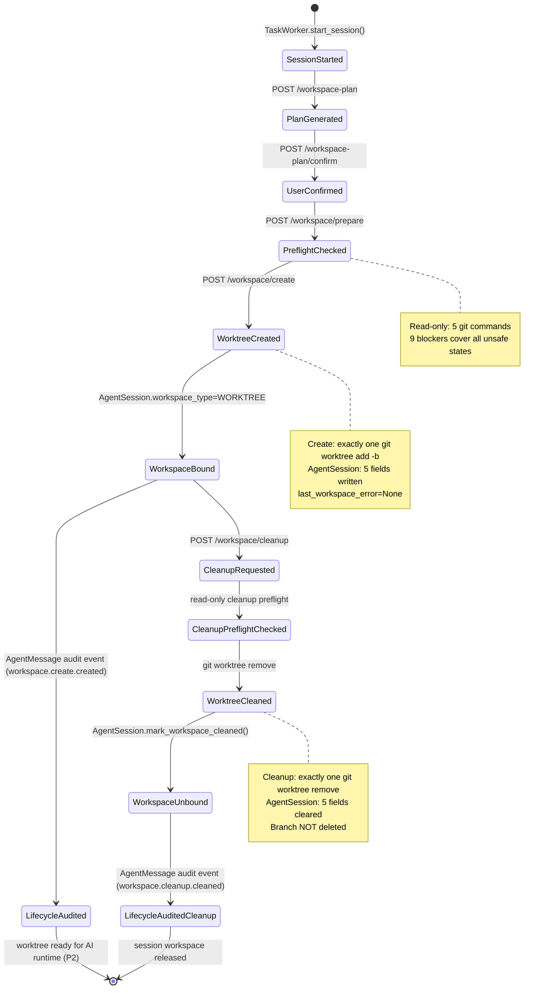

# Coding Session + Worktree Lifecycle P1 收口

> **文档类型**: P1 生命周期收口审计
> **生成日期**: 2026-06-05
> **基准 commit**: `5bf682939d7544fa431e199627cb012929215950`
> **参考项目**: ComposioHQ Agent Orchestrator (`c3eeecb`)
> **前置文档**:
> - `.kkr/skills/ai-project-director-command-governance/SKILL.md`
> - `docs/product/ai-project-director/coding-session-lifecycle-design-20260604.md`
> - `docs/product/ai-project-director/verification-worktree-create-p1deb-real-create-20260605.md`
> - `docs/product/ai-project-director/verification-worktree-cleanup-p1ec-real-cleanup-20260605.md`
> - `docs/product/ai-project-director/worktree-cleanup-p1e-design-audit-20260605.md`
> **边界**: 收口审计，不改代码，不新增功能
> **状态**: P1 机制级闭环 Pass；AI Project Director 总闭环 Partial

---

## 0. 核对过的文件清单

### AI-Dev-Orchestrator (13 个)

| 文件 | 用途 |
|------|------|
| `app/domain/agent_session.py` | AgentSession 领域模型 (WorkspaceType, 10 workspace/branch/error 字段) |
| `app/repositories/agent_session_repository.py` | `update_status()` + `mark_workspace_cleaned()` — workspace CRUD |
| `app/services/worktree_plan_service.py` | BranchNamePolicy + WorktreeGuardService + WorktreePlanService (dry-run) |
| `app/services/worktree_plan_confirmation_service.py` | plan_hash 验证 + confirmation receipt (非持久化) |
| `app/services/worktree_create_service.py` | 17-guard 链 + `git worktree add -b` + AgentSession 写回 + audit event |
| `app/services/worktree_cleanup_service.py` | 13-guard cleanup 链 + `git worktree remove` + `mark_workspace_cleaned()` + audit event |
| `app/services/worktree_command_runner.py` | deny-by-default 只读 allowlist (5 specs) |
| `app/services/worktree_write_command_runner.py` | `WorktreeWriteCommandRunner` — 唯一 allowlisted 写: `git worktree add -b` |
| `app/services/worktree_cleanup_write_command_runner.py` | `WorktreeCleanupWriteCommandRunner` — 唯一 allowlisted 写: `git worktree remove <path>` |
| `app/services/workspace_lifecycle_audit_service.py` | WorkspaceLifecycleAuditService — AgentMessage timeline audit events |
| `app/repositories/agent_message_repository.py` | AgentMessage CRUD + sequence_no |
| `app/api/routes/agent_threads.py` | workspace-plan, /confirm, /prepare, /create, /cleanup endpoint chain |
| `tests/test_worktree_plan_dry_run.py` | 55+ tests covering plan/confirm/prepare/create/cleanup/audit |

### Agent Orchestrator (6 个)

| 文件 | 参考要点 |
|------|---------|
| `README.md` | spawn → workspace.create → runtime.create → agent → PR → cleanup lifecycle |
| `ARCHITECTURE.md` | hash-based 目录结构, worktree 布局, archive 目录 |
| `packages/core/src/session-manager.ts` | CleanupStack 回滚模式, `kill()` runtime→workspace→archived |
| `packages/core/src/lifecycle-manager.ts` | 轮询循环 + status detection + reaction engine |
| `packages/core/src/lifecycle-state.ts` | CanonicalSessionLifecycle (session / pr / runtime 三元组) |
| `packages/plugins/workspace-worktree/src/index.ts` | `destroy()`: git worktree remove --force, 不删 branch |

---

## 1. P1 当前完成范围

### 1.1 已完成组件 (按阶段)

| 阶段 | 组件 | 关键文件 | 验证状态 |
|------|------|----------|---------|
| P0 | AgentSession P0 coding fields | `agent_session.py` | ✅ `agent_type`, `runtime_type`, `coding_status`, `activity_state`, `branch_name` |
| P0 | AgentSession P1 workspace fields | `agent_session.py` | ✅ `workspace_type`, `workspace_path`, `workspace_clean`, `last_workspace_error` |
| P1-A | RepositoryWorkspace binding | `repository_workspace_repository.py` | ✅ `allowed_workspace_root` + `root_path` |
| P1-C | WorktreePlan dry-run | `worktree_plan_service.py` | ✅ `safe`, `dry_run=True`, `plan_hash` (SHA-256), `git_commands_to_run` |
| P1-C | BranchNamePolicy | `worktree_plan_service.py` | ✅ 确定分支名 `session/proj-<hex8>-<hex8>`, 注入安全 |
| P1-C | WorktreeGuardService | `worktree_plan_service.py` | ✅ 绝对路径, allowed root, 源仓库隔离 |
| P1-D-B | Plan confirmation receipt | `worktree_plan_confirmation_service.py` | ✅ plan_hash 验证 + confirmation receipt |
| P1-D-D | Read-only git preflight | `worktree_git_preflight_service.py` | ✅ 5 只读命令, 9 blocker 全覆盖 |
| P1-D-E-B | Real `git worktree add -b` | `worktree_create_service.py` | ✅ 创建 worktree + branch + AgentSession 写回 |
| P1-E-C | Real `git worktree remove` | `worktree_cleanup_service.py` | ✅ 清理 clean registered worktree + AgentSession 解除绑定 |
| P1-E-C | WorkspaceLifecycleAuditService | `workspace_lifecycle_audit_service.py` | ✅ AgentMessage timeline 审计记录 (best-effort) |

### 1.2 Write command runner 安全矩阵

| Runner | 唯一允许的命令 | command_kind | 不执行的命令 |
|--------|---------------|-------------|------------|
| `WorktreeWriteCommandRunner` | `git worktree add -b <branch> <path> <ref>` | `git_worktree_add_new_branch` | `git worktree remove`, `git branch -d`, `git add`, `git commit`, `git push` |
| `WorktreeCleanupWriteCommandRunner` | `git worktree remove <absolute_path>` | `git_worktree_remove` | `git branch -d`, `git branch -D`, `rm -rf`, `shutil.rmtree` |

两个写 runner 的 `_ensure_*_allowlisted()` 各自独立，各只允许**一个**命令形状。这是 P1 最重要的安全边界。

---

## 2. 当前生命周期流程



---

## 3. 四轴生命周期模型状态

设计基线文档 `coding-session-lifecycle-design-20260604.md` 定义了四轴模型。以下是 P1 收口时的四轴实现状态：

### 3.1 Session Axis — 部分实现

| 状态 | P1 能力 | 实现点 |
|------|---------|--------|
| `not_started → spawning → working` | ✅ | AgentSession P0 coding_status (TaskWorker 填充) |
| `working → completed/failed` | ✅ | TaskWorker finalize_session() |
| `working → idle/needs_input/stuck` | ❌ | 无 agent 活动探活 (P2) |
| `detecting` | ❌ | 无 process 探活 (P2) |

### 3.2 Workspace Axis — ✅ P1 机制级闭环

| 状态 | P1 能力 | 实现点 |
|------|---------|--------|
| `not_created → creating` | ✅ | WorktreePlanService + WorktreeWriteCommandRunner |
| `creating → ready` | ✅ | `git worktree add -b` + AgentSession workspace 写回 |
| `ready → cleaned` | ✅ | WorktreeCleanupService + `git worktree remove` + `mark_workspace_cleaned()` |
| `dirty → committed` | ❌ | 无 git add/commit (P2+) |

### 3.3 Runtime Axis — ❌ 未进入闭环

| 状态 | P1 能力 | 实现点 |
|------|---------|--------|
| `unknown → spawning → alive → exited` | ❌ 全部未实现 | 无 agent 进程启动/探活/退出检测 |
| `agent_type`, `runtime_type`, `runtime_handle_id` | ✅ 字段已存在 | P0 填充, 但未连接实际 agent 进程 |

### 3.4 Delivery Axis — ❌ 未进入闭环

| 状态 | P1 能力 | 实现点 |
|------|---------|--------|
| `none → branch_created → pr_opened → ... → merged` | ❌ 全部未实现 | 无 git push, 无 PR, 无 CI, 无 review |
| `delivery_status` enum | ✅ 枚举已定义 | 但从未设置为 `branch_created` 及以上状态 |

---

## 4. 当前真实能力清单

### 4.1 已实现的真实能力

| 能力 | 说明 | 验证方式 |
|------|------|---------|
| 真实创建 worktree | `git worktree add -b` 在 tmp_path 测试仓库中创建隔离 worktree | ✅ 18 create/cleanup tests pass |
| 真实创建 branch | 同一原子操作创建 `session/*` branch | ✅ test 验证 branch 存在 |
| 真实清理 clean registered worktree | `git worktree remove <path>` 移除 worktree | ✅ test 验证 worktree 已删除 |
| 不删除 branch | cleanup 只删 worktree, 不执行 `git branch -d` | ✅ test 验证 branch 在 cleanup 后仍存在 |
| AgentSession workspace 写回 (create) | `workspace_type=WORKTREE`, `workspace_path=<path>`, `workspace_clean=True`, `branch_name=<name>`, `last_workspace_error=None` | ✅ `update_status()` |
| AgentSession workspace 解绑 (cleanup) | `workspace_path=None`, `branch_name=None`, `workspace_type=IN_PLACE`, `workspace_clean=None`, `last_workspace_error=None` | ✅ `mark_workspace_cleaned()` |
| AgentMessage audit event (create) | `workspace.create.created` / `workspace.create.blocked` / `workspace.create.failed` — SYSTEM NOTE_EVENT | ✅ `WorkspaceLifecycleAuditService.record_create_result()` |
| AgentMessage audit event (cleanup) | `workspace.cleanup.cleaned` / `workspace.cleanup.blocked` / `workspace.cleanup.failed` — SYSTEM NOTE_EVENT | ✅ `WorkspaceLifecycleAuditService.record_cleanup_result()` |
| Audit 写入失败不破坏主流程 | `begin_nested()` savepoint + silent exception catch | ✅ 代码: `_record_audit_event()` L531-537 |
| last_workspace_error 写入 (失败路径) | 失败时写入 bounded error message (截断 2000 字符) | ✅ `_write_last_workspace_error()` |
| last_workspace_error 清空 (成功路径) | 成功时显式设置 None | ✅ `mark_workspace_cleaned()` + `update_status(last_workspace_error=None)` |

### 4.2 安全边界 (已强制)

| 边界 | 生效位置 |
|------|---------|
| user_confirmed 必须 True | `WorktreeCreateService` L50-53, `WorktreeCleanupService` L270-273 |
| plan_hash 必须匹配当前 plan | stale hash → 409 Conflict |
| preflight 必须无 blocker | 6 cleanup blockers + 6 create blockers |
| worktree_path 必须在 allowed root 下 | `WorktreeGuardService` + `WorktreeCleanupPreflightService._inspect_path()` |
| worktree 必须 clean 才能 cleanup | `worktree_clean=False` → blocker |
| branch 不以 "-" 开头 | `WorktreeWriteCommandRunner._ensure_write_allowlisted()` |
| 命令仅 allowlist 形状 | `_ensure_write_allowlisted()` / `_ensure_cleanup_allowlisted()` |
| subprocess 无 shell=True | `capture_output=True`, `check=False`, `timeout=120s` |

---

## 5. 当前禁止项 (P1 边界)

| 禁止项 | 说明 | 验证 |
|--------|------|------|
| 不运行 AI runtime | 无 Claude Code / Codex 进程启动 | ✅ grep 零 runtime launch |
| 不让 AI 进入 worktree 自动改代码 | spawn/exec 调用零 | ✅ 无 worker dispatch |
| 不自动 git add / commit / push | 写 runner 只 allowlist `git worktree add` + `git worktree remove` | ✅ 无 git add/commit/push 方法 |
| 不创建 PR | 无 SCM 集成 | ✅ 无 gh pr |
| 不删除 branch | cleanup 不执行 `git branch -d` | ✅ branch delete 永远 `execution_enabled=False` |
| 不执行 rm-rf / rmtree / unlink / rmdir | 只用 `git worktree remove` | ✅ grep 零命中 |
| 不接 CI | 无 CI integration | ✅ |
| 不把 AI Project Director 总闭环标记为 Pass | 所有验证文档均声明 `AI Project Director 总闭环: Partial` | ✅ |

---

## 6. 与 Agent Orchestrator 的机制级对比

| 机制 | Agent Orchestrator | AI-Dev-Orchestrator (P1) | 差距 |
|------|-------------------|-------------------------|------|
| Worktree create | `workspace-worktree.create()` — `git worktree add -b` / `--detach` + `switch -c` | `WorktreeWriteCommandRunner` — `git worktree add -b` | ✅ 对等 |
| Worktree destroy | `workspace-worktree.destroy()` — `git worktree remove --force` | `WorktreeCleanupWriteCommandRunner` — `git worktree remove` | ✅ 对等 (不 force) |
| Branch delete | **不删** (design choice) | **不删** (跟随 AO 设计) | ✅ 一致 |
| CleanupStack (rollback) | ✅ spawn → cleanup stack LIFO undo | ❌ | P2+ 需引入 |
| Agent process lifecycle | ✅ `Runtime.create()` + `Runtime.isAlive()` | ❌ | P2 scope |
| Activity detection | ✅ `ActivitySignal` (native/terminal/hook) | ❌ | P2 scope |
| PR/CI/Review lifecycle | ✅ `SCM.detectPR()` + `LifecycleManager` 轮询 | ❌ | P2+ scope |
| Canonical Session Lifecycle | ✅ tri-axis (session/pr/runtime) | AgentSession flat fields (P1) | P2 multi-axis needed |
| Audit / operation events | ✅ `recordActivityEvent()` structured events | `WorkspaceLifecycleAuditService` AgentMessage timeline | ✅ 基础对等 |

---

## 7. 当前缺口

### 7.1 P1 机制级缺口 (worktree lifecycle 自身)

| 缺口 | 严重度 | 说明 |
|------|--------|------|
| branch cleanup 未实现 | 中 | 设计审计决定跟随 AO 不删 branch; 但后续 `git branch --merged` 批量清理仍需实现 |
| CleanupStack (create 失败回滚) | 中 | `git worktree add -b` 成功但 AgentSession 写回失败时，worktree 成为孤立资源 |
| 幂等 guard (重复 create/cleanup) | 低 | create 无幂等检查; cleanup 通过 `workspace_path=None` 部分幂等 |
| 前端只读展示 | 低 | workspace 字段在 AgentSession DTO 中已暴露，但前端无对应 UI |

### 7.2 P2+ 缺口 (跨轴闭环)

| 缺口 | 说明 |
|------|------|
| AI runtime 未进入 worktree | 不启动 Claude Code / Codex 进程; `TaskWorker` 仍在项目根目录 subprocess |
| Worker 与 AgentSession 关系未抽象 | `TaskWorker` 直接调用 `AgentConversationService.start_session()`, 不知道 worktree |
| 失败日志自动回流给 Agent | agent 不知道 CI/review/preflight 失败 |
| commit candidate / repository draft 与 worktree 未打通 | `ChangeSession` 是项目级, 不与 AgentSession workspace 关联 |
| PR 未实现 | 无 SCM 集成, 无 `git push` |
| 前端只读展示未补齐 | AgentSession workspace 字段已暴露但无 UI |
| activity 探活未实现 | 无 `Agent.getActivityState()` 等价物 |

### 7.3 关键声明

> **P1 机制级闭环 ≠ AI Project Director 总闭环。** P1 完成了 worktree 创建和清理的基础设施，但 agent 运行、代码修改、提交、PR、CI、review 全部在 P2+ 范围内。

---

## 8. P2 第一阶段建议路线

以下路线只建议，不执行。

| 阶段 | 目标 | 说明 |
|------|------|------|
| **P2-A** | 前端只读展示补齐 | AgentSession workspace 字段在 UI 中可见: workspace_type, workspace_path, branch_name, workspace_clean |
| **P2-B** | Worker 使用 AgentSession workspace_path 的只读验证 | `TaskWorker` 启动前检查 workspace_type=WORKTREE，确认 worktree path 存在且 clean |
| **P2-C** | AI runtime in worktree dry-run | 不实际启动 AI 进程, 仅验证 runtime launch 命令能正确指向 worktree_path |
| **P2-D** | 失败日志回流设计 | Design audit: CI failure / preflight failure 如何回流给 agent |
| **P2-E** | commit candidate / repository draft 衔接设计 | Design audit: AgentSession.workspace_path → ChangeSession → CommitCandidate 链路 |

---

## 9. 不建议现在做的事

| 不建议 | 原因 |
|--------|------|
| 先做完整 CI/CD | 当前无 AI runtime, 无 branch push, CI 无从接入 |
| 先做 PR | 需要 SCM 集成 (gh CLI / GitHub API)，P2+ |
| 先做 branch delete | 设计审计已决定跟随 AO 不自动删 branch |
| 先做复杂前端设计系统 | P1 是后端基础设施 |
| 切换技术栈 | 不引入 Node.js, TypeScript, agent-orchestrator 代码 |
| 照搬 Agent Orchestrator 插件系统 | AI-Dev 用 Python + SQLite, 插件系统过度设计 |
| 把 AI Project Director 总闭环标记为 Pass | 总闭环仍为 Partial |

---

## 10. 测试命令与结果

### 10.1 目标测试 (create + cleanup + audit)

```
$ runtime/orchestrator/.venv/bin/pytest \
    runtime/orchestrator/tests/test_worktree_plan_dry_run.py -q \
    -k "worktree_create or worktree_cleanup or workspace_audit"

18 passed, 34 deselected in 2.70s
```

### 10.2 相邻测试 (P0 coding fields)

```
$ runtime/orchestrator/.venv/bin/pytest \
    runtime/orchestrator/tests/test_agent_session_p0_coding_fields.py -q

6 passed in 0.37s
```

### 10.3 补充验证

```
$ python3 -m compileall -q runtime/orchestrator/app runtime/orchestrator/tests
(no output — clean)

$ git diff --check
(no output — clean)
```

### 10.4 覆盖统计

| 分类 | 测试数 | 覆盖范围 |
|------|--------|---------|
| Worktree plan (P1-C) | 10 | plan, hash, API |
| Command runner (P1-D-A) | 3 | deny-by-default + 无写方法 |
| Confirmation (P1-D-B) | 4 | receipt + hash mismatch |
| Prepare skeleton (P1-D-C) | 5 | blocked skeleton + stale hash |
| Blocker tightening (P1-D-D-2) | 4 | 4 unsafe preflight states |
| Git preflight (P1-D-D) | 5 | read-only commands + dirty repo |
| Create blocked (P1-D-E-A) | 6 | blocked skeleton + DTO guards |
| Create real (P1-D-E-B) | 5 | real `git worktree add -b` + AgentSession 写回 |
| Cleanup blocked (P1-E-A) | 4 | blocked skeleton + stale hash + DTO + endpoint |
| Cleanup preflight (P1-E-B) | 4 | read-only preflight + dirty blocker + missing skip |
| Cleanup real (P1-E-C) | 3 | real `git worktree remove` + AgentSession 解绑 |
| P0 coding fields | 6 | AgentSession round-trip + DTO |

**总计: 59 tests (53 worktree lifecycle + 6 P0)**

---

## 11. Gate 结论

### 11.1 Coding Session + Worktree Lifecycle P1 机制级闭环: **Pass** ✅

**依据**:

1. ✅ Worktree 创建: `git worktree add -b` 真实执行，per-AgentSession worktree + branch 创建
2. ✅ Worktree 清理: `git worktree remove` 真实执行，clean registered worktree 安全删除
3. ✅ AgentSession 写回: create 写 5 字段, cleanup 解绑 5 字段
4. ✅ AgentMessage audit: `WorkspaceLifecycleAuditService` 记录 create/cleanup 生命周期事件；写入失败 best-effort，不破坏主流程
5. ✅ 双 allowlist 写命令边界: `WorktreeWriteCommandRunner` (add) + `WorktreeCleanupWriteCommandRunner` (remove)，各自只允许一个命令形状
6. ✅ 完整 guard 链: plan_hash, user_confirmed, preflight blockers, path safety, worktree clean
7. ✅ 不删 branch: 跟随 agent-orchestrator 设计选择
8. ✅ 不启动 AI runtime, 不 git add/commit/push/PR
9. ✅ 59 tests pass, compileall clean, git diff check clean

**P1 机制级闭环定义**: AgentSession 从 "无 worktree" 到 "有 worktree" 再回到 "无 worktree" 的完整生命周期，每一步都有 audit event 记录。

### 11.2 AI Project Director 总闭环: **仍为 Partial**

**原因**: P0 → P1-A → P1-B → P1-C → P1-D-A → P1-D-B → P1-D-C → P1-D-D → P1-D-D-2 → P1-D-E-A → P1-D-E-B → P1-E-A → P1-E-B → P1-E-C 全部 Pass。但:

- Runtime Axis: ❌ AI agent 进程未启动
- Delivery Axis: ❌ 无 git push / PR / CI / review
- 四轴独立变化 + 联合推导整体状态: ❌ 未实现
- Worker ↔ AgentSession ↔ Worktree 衔接: ❌ 未抽象

**不能标记为 Pass** — P1 完成了 worktree 基础设施，但 Coding Session 的真正价值（AI runtime 在隔离 worktree 中自主编码）尚未实现。
