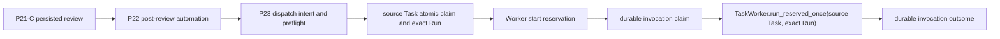

# P24-A: Cross-Task AUTO_CONTINUE Execution Contract Design

## 1. Status and Decision

```text
P24-A scope: design contract only
Production code: not changed
Tests: not changed and not run
Product runtime Git write: forbidden
AI Project Director total loop: Partial
```

P24 starts only after one exact source Task has durable success evidence. It resolves the immediately following Task from the ordered queue persisted by the same confirmed plan, builds an immutable instruction package, evaluates only that exact Task, reserves one exact Run, and invokes the Worker through an at-most-once claim/outcome boundary.

The current repository has a useful execution-success tuple, but it does **not** yet have a sufficient cross-task completion signal. `Task.status=completed` and `Run.status=succeeded` with `quality_gate_passed=true` prove the worker state machine's persisted completion result. They do not prove that every business-required verification was explicitly configured, atomically prove that delivery/approval obligations are settled, prove that no recovery is required, or provide an immutable `source_completion_evidence_id`. P24 therefore requires a new append-only source-completion evidence record before the next Task may start. Missing evidence always fails closed.

This document chooses an independent P24 lineage and audit stream over extending P23 records in place. P23 remains source-task-only. P24 may extract and reuse lower-level exact Task/Run reservation and Worker invocation primitives, but its package, idempotency identity, and continuation records are separate.

## 2. Repository Fact Baseline

### 2.1 Evidence references

| Concern | Repository evidence | Contract consequence |
|---|---|---|
| Task success transition | `TaskStateMachineService.build_execution_resolution()` in `runtime/orchestrator/app/services/task_state_machine_service.py` sets `TaskStatus.COMPLETED`, `RunStatus.SUCCEEDED`, and `quality_gate_passed=true` only when execution succeeds and verification passes, or when no verification is required | These persisted Task/Run fields are mandatory completion inputs |
| Stage completion | `TaskStateMachineService.is_project_stage_complete()` accepts only `TaskStatus.COMPLETED` | Failed, blocked, running, paused, and waiting-human Tasks cannot trigger P24 |
| Worker finalization | `TaskWorker._finalize_execution()` updates the Task and exact Run; `_execute_running_task_run()` commits them | P24 must reload persisted rows and never trust the returned `WorkerRunResult` alone |
| Delivery/approval timing | `TaskWorker._execute_running_task_run()` commits Task/Run before `_auto_create_run_deliverable()` and `_auto_create_run_approval()`; both helpers are best-effort and approval starts as `pending_approval` | Task/Run success is not sufficient proof that no human approval is pending |
| Publish completion | No `publish_completed` field, event, or record exists in the repository | P24 cannot infer publication/delivery completion; an explicit policy/result is required |
| P23 outcome | `ProjectDirectorProtectedTransitionWorkerInvocationService._build_outcome()` sets `continuation_started` when the shared execution seam was entered; it separately records Task/Run status and recovery flags | `continuation_started=true` proves start, not success |
| Exact Worker seam | `TaskWorker.run_reserved_once(task_id, run_id)` validates and executes one pre-existing running Task/Run without routing or creating another Run | Reusable after a P24-specific reservation and claim |
| P23 invocation safety | `ProjectDirectorProtectedTransitionWorkerInvocationService.invoke_reserved_protected_transition_worker()` performs claim transaction, external call outside a write transaction, then outcome transaction | Pattern is reusable; P23 domain identity is not |
| Exact task evaluation | `TaskRouterService.evaluate_exact_task_for_dispatch(task=...)` evaluates one caller-provided Task; `route_next_task()` scans/ranks the global pending queue | P24 must call only the exact evaluator |
| Base readiness | `TaskReadinessService.evaluate_task()` checks pending status, dependencies, human state, and pause state | Necessary but insufficient for P24 config/workspace/active-session checks |
| Plan task order | `ProjectDirectorTaskCreationService._create_tasks_atomic()` creates Tasks in `plan_version.proposed_tasks` order; `_create_task_queue_for_plan_version()` persists those IDs in the same order | `ProjectDirectorTaskCreationRecord.task_ids` is the authoritative queue |
| Task lineage | Task creation writes `source_draft_id = pdv:<plan_version_id>:<version_no>` | Parse only as a locator, then cross-check persisted plan and creation records |
| Creation uniqueness | `ProjectDirectorTaskCreationRecordTable` has `uq_task_creation_records_plan_version` | Exactly one creation record should exist per plan version |
| Creation-record parsing gap | `ProjectDirectorTaskCreationRecordRepository._to_domain()` silently drops malformed UUID entries | P24 needs a strict loader; lossy parsing must fail closed |
| Instruction sources | Confirmed plan version plus agent-team, skill, repository-binding, verification configs and `RepositoryWorkspace` contain scope/role/skill/verification/workspace facts | Suggestions or pending configs cannot authorize execution |

### 2.2 Current chain



P23's target remains `source_task_id`. It does not locate another Task and does not prove that the source Task eventually satisfied every P24 completion obligation.

### 2.3 P24 target chain

```mermaid
flowchart LR
    A["source Task durable success"] --> B["source completion evidence"]
    B --> C["confirmed plan queue resolver"]
    C --> D["exact next Task"]
    D --> E["immutable instruction package"]
    E --> F["exact readiness and config gates"]
    F --> G["continuation root record"]
    G --> H["atomic exact Task claim and Run"]
    H --> I["Worker start reservation"]
    I --> J["invocation claim"]
    J --> K["TaskWorker.run_reserved_once(next Task, exact Run)"]
    K --> L["durable invocation outcome"]
```



## 3. Source Completion Evidence Contract

### 3.1 Current repository conclusion

The repository does **not** currently expose a single reliable `source_completion_evidence` suitable for P24. The following values are explicitly insufficient on their own:

```text
P23 continuation_started = true
Worker was called
Worker returned an object
Run was created
Task entered running
Task.status = completed without an exact successful Run binding
Run.status = succeeded without the matching Task and completion policy
```

The strongest existing partial tuple is:

```text
Task.id = source_task_id
Task.status = completed
Task.human_status in {none, resolved}
Task.paused_reason is null

Run.id = source_success_run_id
Run.task_id = source_task_id
Run.status = succeeded
Run.finished_at is not null
Run.quality_gate_passed = true
Run.failure_category is null

P23 invocation outcome.run_id = source_success_run_id
P23 invocation outcome.source_task_id = source_task_id
P23 invocation outcome.outcome_status = returned
P23 invocation outcome.worker_result_contract_valid = true
P23 invocation outcome.human_recovery_required = false
P23 invocation outcome.blocked_reasons = []
P23 invocation outcome.worker_reported_git_write_activity = false
```

Even this tuple lacks an explicit completion-policy result for deliverable publication and human approval. The current Worker may create a `pending_approval` record after Task/Run success, and creation failure is swallowed. Therefore P24 must not start from this tuple directly.

### 3.2 New minimum seam

P24-B must introduce `ProjectDirectorSourceTaskCompletionEvidence` as an immutable DomainModel persisted in an append-only `ProjectDirectorMessage`. It is a derived, auditable completion certificate, not a mutable Task field.

Suggested message metadata:

```text
source_detail = p24_source_task_completion_evidence_recorded
intent = cross_task_source_completion_evidence
action type = p24_source_task_completion_evidence_record
schema_version = p24-b-completion.v1
related_plan_version_id = exact plan version
related_project_id = exact project
related_task_id = source Task
```

Required fields:

```text
schema_version
completion_evidence_id
completion_fingerprint
created_at

session_id
project_id
plan_version_id
task_creation_record_id
source_task_id
source_success_run_id

source_p23_invocation_outcome_id
source_review_id
source_review_outcome
source_transition_evidence_ids

task_status
task_human_status
task_paused_reason_absent
run_status
run_finished_at
run_quality_gate_passed
run_failure_category_absent
verification_requirement
verification_evidence

agent_session_id
agent_session_status
agent_session_phase
runtime_terminal

delivery_requirement
deliverable_id
deliverable_version_id
delivery_status
approval_requirement
approval_id
approval_status

pending_human_approval_absent
recovery_required
worker_reported_git_write_activity
product_runtime_git_write_allowed
blocked_reasons
```

### 3.3 Issuance predicate

The evidence resolver may issue `completion_status=confirmed` only when all applicable predicates are true:

1. The persisted Task and exact persisted Run satisfy the partial tuple above.
2. The P23 invocation outcome binds the same Task and Run, has a valid exact reserved-run snapshot, reports no recovery, and contains no blocked reason.
3. If an AgentSession exists for the Run, it is `completed`, phase is `finalized`, its Task/Run binding matches, and no active runtime state remains. Missing or multiple conflicting sessions fail closed.
4. Verification policy is explicit. `required` needs persisted passing verification evidence; `not_required` must come from a persisted confirmed policy and must not be inferred merely because `Run.verification_mode` is null.
5. Delivery policy is explicit. If delivery is required, the exact Run-bound deliverable/version exists and is in its required terminal state.
6. Approval policy is explicit. If approval is required, the exact deliverable version has `ApprovalStatus.APPROVED`. `PENDING_APPROVAL`, `REJECTED`, or `CHANGES_REQUESTED` blocks issuance. If approval is not required, a confirmed policy must say so; absence of an approval row is not proof of `not_required`.
7. No pending Task human state, no P23 recovery flag, no active Run/AgentSession for the source completion, and no detected product runtime Git activity exist.
8. `product_runtime_git_write_allowed=false` is fixed.

The current repository lacks the explicit verification/delivery/approval completion-policy record needed by predicates 4-6. P24-B must add the smallest persisted policy/result seam or bind an existing confirmed policy where one is unambiguous. Until then the resolver returns `source_completion_evidence_missing` or `source_completion_policy_unresolved`, persists a blocked audit result if appropriate, and never starts the next Task.

### 3.4 Identity, fingerprint, and replay

Stable completion identity:

```text
(plan_version_id, source_task_id, source_success_run_id, action=source_task_completion)
```

The resolver runs inside `BEGIN IMMEDIATE`, scans the complete session history, strictly reconstructs candidate messages, and either returns one exact existing evidence record or creates one. Multiple records, malformed records, or a changed semantic fingerprint produce `source_completion_evidence_conflict` and require human recovery.

The SHA-256 fingerprint covers canonical JSON for all semantic fields, including the evidence ID and all bound evidence IDs, but excluding only `completion_fingerprint` and replay-only response flags. Objects use sorted keys, UUIDs use canonical lowercase text, datetimes use UTC RFC 3339, ordered plan arrays preserve order, and set-like path/action arrays are normalized and sorted.

## 4. Confirmed Plan Lineage Contract

### 4.1 Safe `source_draft_id` parsing

The resolver accepts only this grammar:

```text
^pdv:([0-9a-fA-F-]{36}):([1-9][0-9]*)$
```

It then parses group 1 as a UUID and requires its canonical UUID text to equal the parsed value case-insensitively. Group 2 is a positive base-10 integer with no sign. Extra segments, whitespace, noncanonical UUIDs, zero/negative version numbers, or overflow are `plan_lineage_invalid`.

The string is only a locator. It is never the authority.

### 4.2 Cross-validation algorithm

For `source_task_id` and trusted completion evidence:

1. Reload the source Task and require the exact Task/Run/evidence binding.
2. Parse `source_task.source_draft_id` into `(plan_version_id, version_no)`.
3. Load the plan with `ProjectDirectorPlanVersionRepository.get_by_id()` and require `status=confirmed`.
4. Load exactly one `ProjectDirectorTaskCreationRecord` by `plan_version_id`.
5. Require the creation record's `source_type=project_director_plan_version`.
6. Require plan ID/version/session/project to match the parsed locator, completion evidence, Task project, creation record, and current Project Director session.
7. Strictly decode raw `task_ids_json`. It must be a JSON array of canonical UUIDs with no dropped/invalid entries, no duplicates, and `task_count == len(task_ids) > 0`.
8. Require `len(task_ids) == len(plan_version.proposed_tasks)` because task creation preserves that order.
9. Load every Task ID. Missing Tasks are a persistence fault. Every Task must have the same project and exact `pdv:<id>:<version>` lineage.
10. Require `source_task_id` to occur exactly once.

The current creation repository's lossy UUID parsing is not acceptable for this resolver. P24-C must add a strict read path or strict raw-row validation without weakening existing callers.

### 4.3 Ambiguity and rejection

Fail closed for:

```text
source_draft_id malformed or missing
plan version missing, not confirmed, or version mismatch
creation record missing or multiple/conflicting
session or project mismatch
task_ids malformed, empty, duplicated, truncated, or count-mismatched
source Task absent from task_ids or present more than once
any queue Task missing or carrying different lineage
plan proposed-task count mismatch
```

## 5. Exact Next Task Resolution

The authoritative algorithm is:

```text
source_index = task_ids.index(source_task_id)
next_index = source_index + 1

if next_index == len(task_ids):
    plan_queue_exhausted
else:
    next_task_id = task_ids[next_index]
```

The resolver then reloads `next_task_id` and revalidates its project and lineage. It never creates or reconstructs a business Task.

Permanent selection rules:

```text
Do not call TaskRouterService.route_next_task().
Do not scan the global pending queue.
Do not rank by priority to change plan order.
Do not cross project, session, or plan version.
Do not skip a blocked next Task.
Do not call create_tasks_from_plan_version().
Do not call create_formal_project_from_plan_version().
Do not recreate a missing next Task from ProposedTask.
Do not synthesize a continuation Task.
```

If the creation record names a next Task that is absent from the Task table, return `next_task_missing`, classify it as persistence corruption, and require human recovery.

Resolver outcomes:

```text
next_task_resolved
plan_queue_exhausted
source_task_not_in_plan_queue
plan_creation_record_missing
plan_lineage_invalid
next_task_missing
next_task_not_ready
next_task_state_conflict
next_task_dependency_blocked
next_task_budget_blocked
human_intervention_required
```

## 6. Immutable Next Task Instruction Package

### 6.1 Domain and persistence

P24-D introduces `ProjectDirectorNextTaskInstructionPackage`. It is stored as one append-only Project Director message and may never be edited after it is referenced by a Run reservation.

```text
source_detail = p24_next_task_instruction_package_prepared
intent = cross_task_next_task_instruction_package
action type = p24_next_task_instruction_package_record
schema_version = p24-d-instruction.v1
```

Required fields:

```text
schema_version
package_id
package_fingerprint
created_at
continuation_id

project_id
session_id
plan_version_id
plan_version_no
task_creation_record_id

source_task_id
source_run_id
source_completion_evidence_id
source_review_id
source_review_outcome
source_transition_evidence_ids

next_task_id
next_task_index
task_count
task_title
task_input_summary
owner_role_code
priority
depends_on_task_ids

confirmed_scope
allowed_paths
forbidden_paths
repository_binding
workspace_binding

acceptance_criteria
verification_requirements
test_requirements
evidence_requirements

selected_strategy
selected_model
selected_skills
risk_level
human_confirmation_required
human_confirmation_evidence_id

product_runtime_git_write_allowed
forbidden_actions
```

### 6.2 Source precedence and fail-closed rules

| Package data | Trusted source | Rejection rule |
|---|---|---|
| Plan/task identity and order | Confirmed plan + strict creation record + persisted next Task | Any mismatch blocks |
| Task title/input/owner/priority/dependencies | Persisted next Task, cross-checked by index against `proposed_tasks[next_index]` | Missing role or divergent lineage blocks |
| Confirmed scope | Confirmed plan `project_scope`, deliverable boundaries, and next ProposedTask description | Empty or contradictory scope blocks |
| Allowed paths | `status=confirmed` repository-binding config `focus_paths`, normalized relative to the real RepositoryWorkspace root | Never infer from the source Task review scope; empty, absolute, escaping, or ambiguous paths block |
| Forbidden paths | Confirmed plan out-of-scope path entries plus repository/workspace safety policy | Contradiction with allowed paths blocks |
| Repository binding | Confirmed repository-binding config for the exact plan | Pending/rejected/missing config blocks |
| Workspace binding | `RepositoryWorkspaceRepository.get_by_project_id()` exact project binding | Missing workspace, root mismatch, or path escape blocks |
| Acceptance criteria | Persisted Task criteria when non-empty, otherwise confirmed plan acceptance criteria | If both are empty, block |
| Verification/test/evidence requirements | Confirmed verification config for exact plan, filtered for the next Task/role; plan acceptance/deliverable evidence requirements supplement it | Pending/rejected/missing required config blocks |
| Role | Next Task owner plus confirmed agent-team config | Missing team role or role mismatch blocks |
| Skills | Confirmed skill-binding config for the resolved owner role, intersected with exact strategy output | Missing required binding or unconfirmed skill blocks |
| Model/strategy | Fresh `evaluate_exact_task_for_dispatch(next_task)` result | Result is a snapshot; revalidate before Run creation |
| Human confirmation | Risk/config policy plus an exact persisted confirmation record | Required but absent/expired/mismatched confirmation blocks |

Task creation currently leaves Task acceptance criteria/dependencies at defaults and creates repository/skill/verification configs initially as `pending_confirmation`. P24 must not reinterpret those defaults as authorization. It must use the confirmed plan/config sources above and fail closed until they are confirmed.

The package always contains:

```text
product_runtime_git_write_allowed = false
```

Its forbidden actions include product runtime `git add`, `git commit`, `git push`, PR/merge, branch destruction, uncontrolled workspace writes, global Task routing, plan mutation, and duplicate Task creation.

### 6.3 Immutability and versioning

The fingerprint uses the same canonical JSON rules as completion evidence and covers every field except `package_fingerprint`. A replay returns the same persisted `package_id`, fingerprint, and payload.

The package replay key is:

```text
sha256(canonical_json({
  schema_version: "p24-package-replay.v1",
  action: "cross_task_auto_continue",
  continuation_id,
  source_completion_evidence_id,
  next_task_id
}))
```

The package and continuation root IDs are allocated and persisted in the same immediate transaction. If replay finds one package for this key, it revalidates and returns it. If current plan/config/workspace/confirmation facts no longer reproduce its semantic fingerprint, the package is stale or conflicting and execution stops; the service does not silently create another package.

Any semantic change, including path, model, skill, verification, confirmation, or source-evidence change, requires a new package ID and fingerprint. A package already bound to a continuation or Run is never silently replaced. If a newer package is legitimate, it creates a new explicit version with `supersedes_package_id`; it cannot reuse the original source-completion idempotency key unless the earlier continuation is terminally blocked before Task claim and an explicit human-authorized supersession record exists.

## 7. Append-Only Cross-Task Continuation Record

### 7.1 Logical root and event records

P24 uses one logical `continuation_id` per idempotency key and an append-only sequence of immutable state records. This satisfies both requirements: one valid progression identity and a durable history of later Run/reservation/invocation facts.

Root fields carried by every event:

```text
record_id
continuation_id
schema_version
action = cross_task_auto_continue
source_detail
created_at
sequence_no
previous_record_id

idempotency_key
source_task_id
source_run_id
source_completion_evidence_id
plan_version_id
task_creation_record_id
next_task_id
instruction_package_id

exact_run_id
worker_reservation_id
worker_invocation_claim_id
worker_outcome_id

status
blocked_reasons
replay_of_record_id
product_runtime_git_write_allowed
```

Message metadata:

```text
source_detail = p24_cross_task_continuation_recorded
intent = cross_task_auto_continue
action type = p24_cross_task_continuation_record
schema_version = p24-d-continuation.v1
```

Allowed statuses:

```text
prepared
blocked
plan_queue_exhausted
next_task_reserved
next_task_run_created
worker_start_reserved
worker_invocation_claimed
worker_started
worker_returned
worker_failed
recovery_required
```

`worker_started` means only that the external call boundary was crossed. It is not next-task completion. Completion of that next Task must later produce its own `ProjectDirectorSourceTaskCompletionEvidence`, which may trigger the following continuation.

Allowed state progression:

```text
prepared
  -> blocked
  -> plan_queue_exhausted
  -> next_task_reserved
       -> blocked
       -> next_task_run_created
            -> worker_start_reserved
                 -> worker_invocation_claimed
                      -> worker_started
                           -> worker_returned
                           -> worker_failed
                           -> recovery_required
```

`next_task_reserved` means the continuation/package owns authority for the exact next Task, but no Task status or Run has changed yet. `worker_started` is never written before the external call. It may be represented as an intermediate event only in the post-call outcome transaction when `worker_call_attempted=true`; after a crash with no outcome, the durable claim remains the sole indeterminate-side-effect marker and the state is reported as `recovery_required`.

### 7.2 Stable idempotency key

Canonical key payload:

```text
schema_version = p24-cross-task-idempotency.v1
action = cross_task_auto_continue
plan_version_id
source_task_id
source_success_run_id
source_completion_evidence_id
```

`idempotency_key = sha256(canonical_json(payload))`.

The same key must always replay:

```text
same continuation_id
same next_task_id
same instruction_package_id
same exact_run_id, once created
same reservation/claim/outcome IDs, once created
no repeated Worker call
```

No in-memory lock is authoritative. All first-writer decisions occur under `BEGIN IMMEDIATE` with full-history validation. Multiple valid roots or divergent events for the same key are `continuation_replay_conflict` and require human recovery.

## 8. Exact Next Task Readiness and Dispatch

### 8.1 Layered eligibility

P24 must not overstate `TaskRouterService.evaluate_exact_task_for_dispatch()`. That method currently covers base readiness, dependency state, strategy, role scoring, selected model/skills, attempts, and budget-pressure scoring. P24 adds a wrapper gate for configuration and concurrency facts.

Evaluation order:

1. Reload and validate completion evidence, plan lineage, package, and exact next Task.
2. Require Task status `pending`, human status not requested/in-progress, and no pause reason.
3. Call `TaskReadinessService.evaluate_task(task=next_task)` and preserve structured dependency blockers.
4. Require no active Run for the exact next Task and no active AgentSession for that Task. P24 must add a repository query for active sessions because `get_by_run_id()` alone cannot prove task-wide absence.
5. Revalidate confirmed agent-team, skill, repository-binding, verification, real workspace, and any human-confirmation evidence against the package fingerprint.
6. Call only `TaskRouterService.evaluate_exact_task_for_dispatch(task=next_task)`.
7. Require candidate `ready=true`, readiness ready, strategy/model/role present, budget action not `block`, required selected skills confirmed, and risk/confirmation gates satisfied.
8. Re-run steps 1-7 inside the atomic Run-creation transaction before claiming the Task.

### 8.2 Block classification

| Condition | Class | Replay policy | Required action |
|---|---|---|---|
| Task already completed/failed/blocked or lineage changed | Permanent conflict | No automatic replay | Human investigation |
| Dependency incomplete | Temporary block | Safe to re-evaluate same root before any claim | Wait; do not skip Task |
| Budget blocked | Temporary policy block | Safe to re-evaluate before claim | Wait or human budget action |
| Missing Task, malformed lineage, duplicate record | Persistence/recovery | No automatic mutation | Human recovery |
| Missing/pending/rejected config | Governance block | Safe to re-evaluate before claim if root remains unclaimed | Confirm or correct config |
| Role/skill/repository/workspace mismatch | Governance/scope conflict | No blind retry | Human correction and new package if needed |
| Human confirmation required | Human block | Resume only with exact confirmation evidence | Human decision |
| Existing active Run/AgentSession | Concurrency conflict | Reconcile persisted owner first | Replay existing lineage or recover |
| Claim exists without outcome | Indeterminate side effect | Never recall Worker automatically | Human recovery |

The next Task is never skipped because it is blocked.

## 9. Service Boundaries

| Service | Input / output | Reads | Writes / transaction | Errors and replay |
|---|---|---|---|---|
| `ProjectDirectorSourceCompletionEvidenceResolver` | exact P23 outcome ID, source Task/Run -> confirmed or blocked completion evidence | Task, Run, AgentSession, deliverable, approval, plan lineage, P23 messages, completion policy | One append-only evidence message under `BEGIN IMMEDIATE`; no Task/Run mutation | Full-history replay; missing policy/evidence fails closed |
| `ProjectDirectorConfirmedPlanQueueResolver` | completion evidence -> plan/creation record/source index/exact next Task or exhausted | strict plan, raw creation record, all queue Tasks | Read-only; caller ends read transaction before external work | Deterministic and replayable; malformed/ambiguous lineage blocks |
| `ProjectDirectorNextTaskInstructionPackageBuilder` | resolved queue + confirmed configs + exact strategy -> immutable package | plan, Task, configs, RepositoryWorkspace, confirmation evidence | One package message under `BEGIN IMMEDIATE` | Same semantic input replays package; divergence blocks or requires explicit supersession |
| `ProjectDirectorCrossTaskContinuationRecordService` | idempotency key + state transition -> root/event record | full P24 history and bound messages | Append-only records under `BEGIN IMMEDIATE`; validates predecessor and monotonic sequence | Same state replays; forks/conflicts require recovery |
| `ExactTaskRunReservationService` (shared seam) | explicit target Task, immutable authority package, routing snapshot -> claimed Task + exact running Run | Task/readiness, Run, AgentSession, budget/strategy, authority record | CAS Task claim + `add_running_run_no_event()` + continuation event in one transaction; events published only after commit | Replay returns exact Run; no global routing |
| `ExactWorkerInvocationService` (shared seam) | explicit Task/Run + reservation + authority identity -> claim/outcome | Task, Run, AgentSession, reservation, authority | Claim transaction; Worker call outside write transaction; outcome transaction | Claim without outcome is recovery-required; outcome replays |
| `ProjectDirectorCrossTaskAutoContinueCoordinator` | source completion evidence ID -> unified P24 result | Calls services only | No direct table writes; no long transaction across services or Worker | Resumes at last durable step; never invents missing state |

The coordinator must not directly operate database tables, call `route_next_task()`, create Tasks, mutate a confirmed plan, invoke Worker without a reservation/claim, or bypass package/config validation.

## 10. Transaction and Event Contract

### 10.1 Normal sequence

```mermaid
sequenceDiagram
    participant C as P24 Coordinator
    participant E as Completion Evidence Resolver
    participant Q as Plan Queue Resolver
    participant P as Package/Continuation Service
    participant D as Exact Dispatch Service
    participant W as Exact Worker Invocation Service
    participant TW as TaskWorker

    C->>E: resolve(source Task, exact source Run, P23 outcome)
    E->>E: BEGIN IMMEDIATE; revalidate; append evidence; COMMIT
    E-->>C: completion_evidence_id
    C->>Q: resolve exact next Task
    Q-->>C: next Task or plan_queue_exhausted
    C->>P: prepare package and continuation root
    P->>P: BEGIN IMMEDIATE; scan replay; append package/root; COMMIT
    P-->>C: package_id, continuation_id
    C->>D: reserve exact next Task
    D->>D: BEGIN IMMEDIATE; revalidate; CAS claim; create exact Run; append event; COMMIT
    D-->>C: exact_run_id
    Note over D,C: publish Task/Run events only after commit
    C->>W: prepare Worker reservation
    W->>W: BEGIN IMMEDIATE; revalidate; append reservation; COMMIT
    C->>W: invoke exact reservation
    W->>W: BEGIN IMMEDIATE; append unique claim; COMMIT
    W->>TW: run_reserved_once(next_task_id, exact_run_id)
    Note over W,TW: no P24 write transaction held across call
    TW-->>W: Worker result or exception
    W->>W: BEGIN IMMEDIATE; revalidate; append outcome; COMMIT
    W-->>C: durable outcome or recovery_required
```

`ProjectDirectorMessageRepository.create()` only flushes. The enclosing immediate transaction owns commit/rollback. Task and Run console events must follow the P23-D1 pattern: publish only after the transaction commits. No event may announce a Run, reservation, claim, or outcome that rolled back.

### 10.2 Atomic exact Run creation

Inside one `BEGIN IMMEDIATE` transaction:

```text
scan/replay continuation root and events
revalidate completion evidence and package fingerprint
revalidate exact next Task identity, pending state, dependencies, configs, budget, strategy
assert no active Run or AgentSession for exact next Task
TaskRepository.claim_pending_task(next_task_id)  # compare-and-set pending -> running
RunRepository.add_running_run_no_event(task_id=next_task_id, exact routing snapshot)
append next_task_run_created continuation event binding exact run_id
COMMIT
publish Task claimed and Run created events
```

If any step fails, the transaction rolls back Task claim, Run creation, and the event together. A replay after commit returns the exact persisted Run and does not call `claim_pending_task()` again.

## 11. Replay, Concurrency, and Crash Recovery

### 11.1 Required phase model

```text
Phase A: completion evidence and package/root persistence
Phase B: exact Task claim + exact Run + continuation event (atomic)
Phase C: Worker start reservation persistence
Phase D: invocation claim persistence (commit-before-call)
Phase E: external TaskWorker.run_reserved_once call
Phase F: invocation outcome persistence (outcome-after-return)
```

### 11.2 Recovery sequence

```mermaid
sequenceDiagram
    participant R as Replay Caller
    participant S as P24 Persistence
    participant W as Worker Boundary

    R->>S: load by stable idempotency key
    alt no root/claim exists
        S-->>R: continue from last committed phase
    else root and exact Run exist, no reservation
        S-->>R: reuse exact Run; create reservation
    else reservation exists, no invocation claim
        S-->>R: reuse reservation; claim invocation
    else invocation claim exists, no outcome
        S-->>R: recovery_required; do not call Worker
    else complete outcome exists
        S-->>R: replay original IDs and result
    else conflicting or malformed history
        S-->>R: recovery_required; human reconciliation
    end
```

### 11.3 Crash matrix

| Crash/duplicate point | Persisted fact | Automatic behavior |
|---|---|---|
| Duplicate call before any root | No root | One caller creates root under immediate lock; other replays it |
| Concurrent calls during root/package creation | Serialized history scan | One package/root; all callers receive same IDs |
| Crash after package/root commit | Package and `prepared` root exist | Resume exact readiness; no duplicate package |
| Crash during Task claim/Run creation before commit | Nothing from transaction is durable | Safe to repeat Phase B |
| Crash after exact Run commit, before Worker reservation | Task running, exact Run and event durable | Reuse exact Run; create reservation; never create another Run |
| Crash after reservation commit, before claim | Reservation durable | Safe to create one claim |
| Concurrent invocation attempts | Immediate claim transaction | One claim commits; other sees claim and stops |
| Crash after claim, before Worker call | Claim, no outcome | `recovery_required`; no blind call because call boundary is indeterminate |
| Crash after Worker starts/returns, before outcome commit | Claim, no outcome | `recovery_required`; no blind re-call; reconcile Task/Run/AgentSession/runtime evidence manually or with an explicit recovery protocol |
| Worker raises | Claim plus persisted raised outcome when Phase F succeeds | Return `worker_failed`/`recovery_required`; no auto-recall |
| Crash after complete outcome commit | Full lineage | Replay same outcome and all IDs |
| Outcome persistence fails | Claim remains without outcome | `recovery_required`; never convert memory return into success |

The at-most-once guarantee is an invocation-authority guarantee: a durable claim is consumed before the external call. It deliberately favors fail-closed recovery over automatic retries after an indeterminate side effect.

## 12. State Decision Table

| Input state | Required durable evidence | Continue? | Result | Create Run? | Call Worker? | Human? |
|---|---|---:|---|---:|---:|---:|
| Worker merely started/returned | P23 outcome lacks completion evidence | No | `source_completion_evidence_missing` | No | No | Maybe |
| Task completed but Run missing/mismatched | No exact success binding | No | `source_completion_evidence_invalid` | No | No | Yes |
| Task completed, exact Run succeeded, quality gate passed, approval policy unresolved | Partial success only | No | `source_completion_policy_unresolved` | No | No | Yes |
| Exact success plus pending approval | Exact approval `pending_approval` | No | `human_intervention_required` | No | No | Yes |
| Exact success plus recovery flag | P23 outcome `human_recovery_required=true` or claim without outcome | No | `recovery_required` | No | No | Yes |
| Valid completion, malformed/mismatched lineage | Completion evidence plus invalid plan facts | No | `plan_lineage_invalid` | No | No | Yes |
| Valid completion, source absent from queue | Strict creation record | No | `source_task_not_in_plan_queue` | No | No | Yes |
| Valid completion, source is final queue Task | Strict queue with no next index | No | `plan_queue_exhausted` | No | No | No |
| Next ID declared but Task missing | Strict queue and missing row | No | `next_task_missing` | No | No | Yes |
| Exact next Task dependency incomplete | Readiness dependency snapshot | No | `next_task_dependency_blocked` | No | No | Not initially |
| Exact next Task budget blocked | Budget snapshot | No | `next_task_budget_blocked` | No | No | Maybe |
| Exact next Task needs confirmation | Confirmation policy, no matching evidence | No | `human_intervention_required` | No | No | Yes |
| Exact next Task already running/has active Run | Current Task/Run/session rows | No | `next_task_state_conflict` | No | No | Yes/reconcile |
| Exact next Task fully ready, no prior Run event | Valid package and all gates | Yes | `next_task_run_created` | Once | Not yet | No |
| Exact Run and reservation, no claim | Valid durable lineage | Yes | `worker_invocation_claimed` | No | Once after claim | No |
| Claim exists, no outcome | Claim only | No | `recovery_required` | No | No | Yes |
| Complete outcome exists | Exact claim/outcome | Replay | Existing result | No | No | As recorded |

## 13. Invariants

| Invariant | Enforcement |
|---|---|
| Never duplicate business Tasks | Resolve only IDs in creation record; creation services are forbidden |
| Never reorder/skip confirmed plan Tasks | `next_index = source_index + 1`; blocked next Task stops chain |
| Never select unrelated global Task | `route_next_task()` forbidden; exact evaluator only |
| Never treat Worker start as Task completion | Require immutable completion evidence derived from persisted terminal facts |
| Never duplicate Run | Atomic CAS claim + Run + event; replay returns bound `exact_run_id` |
| Worker invoked at most once per reservation | Commit unique claim before call; claim without outcome requires recovery |
| Never hold DB write lock across Worker/provider call | Three-phase claim/call/outcome boundary |
| Never publish rolled-back state | Task/Run and continuation events publish after commit only |
| Never reuse source review scope as next Task scope | Build package from exact plan/config/workspace sources |
| Never silently mutate used package | New semantic payload requires new package ID/fingerprint |
| Product runtime Git write remains forbidden | Fixed false field plus forbidden-action validation at every layer |
| Missing or ambiguous evidence fails closed | No fallback to memory return, heuristic Task selection, or synthetic records |

## 14. Plan Queue Exhaustion

When the source Task is the last ID in the strict ordered queue, append/replay one terminal continuation event:

```text
status = plan_queue_exhausted
new_task_created = false
run_created = false
worker_called = false
product_runtime_git_write_allowed = false
```

No instruction package for a nonexistent next Task is required. The event still binds completion evidence, plan, creation record, source Task/Run, and queue length for audit.

Possible later actions include project-level acceptance, final summary, human confirmation, or phase closure. P24 does not start any of them automatically.

## 15. P23 Reuse and Compatibility Boundary

### 15.1 Reusable lower-level seams

P24 may extract target-agnostic primitives from:

```text
P23-D1 atomic exact Task claim and exact Run creation
P23-D2-B1 Worker start reservation validation
P23-D2-B2 claim-before-call and durable outcome pattern
TaskWorker.run_reserved_once(exact task_id, exact run_id)
post-commit Task/Run event publication
full-history replay and canonical fingerprint helpers
```

Recommended extraction:

```text
ExactTaskRunReservationService
ExactWorkerStartReservationService
ExactWorkerInvocationService
CanonicalAuditFingerprint helper
```

Each generic primitive receives an immutable authority envelope containing target Task, exact Run where applicable, authority kind (`p23_source_transition` or `p24_cross_task_continuation`), authority record/package ID, fingerprint, and fixed Git boundary. Thin P23 adapters map existing P23 models without changing their wire payloads or replay keys. P24 adapters use P24 models.

### 15.2 Forbidden compatibility changes

P24 must not:

```text
change P23 target_task_id away from source_task_id
change P23 target_task_strategy/source_task_only semantics
reuse a P23 message ID as a P24 continuation/package ID
change P23 replay identities or fingerprints
allow P23 to route another pending Task
weaken P23 same-source concurrency protection
weaken P23 Worker at-most-once behavior
reinterpret P23 continuation_started as completion
```

P23 regression anchors remain:

```text
source_task_only = true
target_task_id = source_task_id
run_reserved_once receives P23 source Task and P23 exact Run
same P23 replay input returns same P23 records
claim without outcome remains recovery_required
```

## 16. Blocked Reason Taxonomy

### Completion

```text
source_completion_evidence_missing
source_completion_evidence_invalid
source_completion_evidence_conflict
source_completion_policy_unresolved
source_task_not_completed
source_run_not_succeeded
source_quality_gate_not_passed
source_verification_evidence_missing
source_delivery_incomplete
source_approval_pending
source_agent_session_not_terminal
source_recovery_required
source_git_boundary_violation
```

### Lineage and queue

```text
plan_lineage_invalid
plan_version_missing
plan_version_not_confirmed
plan_creation_record_missing
plan_creation_record_conflict
plan_task_ids_invalid
source_task_not_in_plan_queue
next_task_missing
next_task_scope_mismatch
plan_queue_exhausted
```

### Package and readiness

```text
confirmed_scope_missing
allowed_paths_missing
repository_binding_not_confirmed
workspace_binding_missing
workspace_binding_mismatch
verification_config_not_confirmed
agent_role_not_confirmed
skill_binding_not_confirmed
instruction_package_conflict
next_task_not_ready
next_task_state_conflict
next_task_dependency_blocked
next_task_budget_blocked
active_run_conflict
active_agent_session_conflict
human_intervention_required
```

### Dispatch and recovery

```text
continuation_replay_conflict
task_claim_conflict
run_creation_failed
run_binding_invalid
worker_start_reservation_conflict
worker_invocation_claim_conflict
worker_invocation_in_progress_or_recovery_required
worker_outcome_persistence_failed_recovery_required
worker_execution_side_effects_indeterminate
```

Blocked responses include stable codes and safe summaries, never raw prompt, environment, command, stdout/stderr, token, secret, or API key data.

## 17. Planned Verification Matrix (Not Executed in P24-A)

Mimo must later cover at least:

```text
valid exact source completion issuance
Task completed but Run mismatched
quality gate false/null
pending/rejected/changes-requested approval
missing explicit approval policy
P23 continuation_started without completion
strict pdv parsing and every lineage mismatch
malformed task_ids_json (including silently-droppable UUID)
duplicate task_ids and task_count mismatch
source middle/last/not-in-queue
next Task missing, blocked, dependency blocked, budget blocked
confirmed vs pending role/skill/repository/verification configs
allowed path escape and source-review-scope leakage rejection
exact evaluator called and route_next_task never called
same-input replay returns same package/Run/outcome IDs
two-thread continuation and invocation races
crash at every phase in the crash matrix
claim-without-outcome never recalls Worker
post-commit event ordering
P23 source-task-only and replay regression
product_runtime_git_write_allowed remains false
```

These are planned tests only. P24-A runs no pytest, runtime, Worker, provider, native executor, or CI.

## 18. Production Stage Split

The delivery order is production code first, then Mimo writes and runs the unified tests.

### P24-B: Source completion evidence and domain contracts

**Goal:** Add immutable completion evidence, strict issuance predicate, and explicit verification/delivery/approval completion-policy seam.

**Expected files:**

```text
runtime/orchestrator/app/domain/project_director_source_task_completion_evidence.py
runtime/orchestrator/app/services/project_director_source_completion_evidence_service.py
runtime/orchestrator/app/repositories/project_director_message_repository.py (only if a bounded strict query helper is needed)
runtime/orchestrator/app/repositories/deliverable_repository.py (read-only exact Run helper if missing)
runtime/orchestrator/app/repositories/approval_repository.py (read-only exact version helper if missing)
runtime/orchestrator/app/repositories/agent_session_repository.py (read-only exact active-state helper if missing)
```

**Forbidden:** next-Task resolution, Task/Run creation, Worker call, API/frontend, tests, product runtime Git write.

**Transaction:** one immediate transaction for completion replay scan and append; no external side effect.

**Acceptance:** current gap is closed with an immutable evidence ID; partial Task/Run or unresolved approval policy fails closed; same exact source completion replays.

**Dependency:** P23 durable outcome and existing Task/Run finalization.

### P24-C: Confirmed plan exact next-Task resolver

**Goal:** Strictly validate `pdv:` lineage and raw creation record, then resolve only `task_ids[index+1]` or exhaustion.

**Expected files:**

```text
runtime/orchestrator/app/domain/project_director_cross_task_plan_queue.py
runtime/orchestrator/app/repositories/project_director_task_creation_repository.py
runtime/orchestrator/app/services/project_director_confirmed_plan_queue_resolver.py
```

**Forbidden:** Task creation/reconstruction, router global selection, Run/Worker, API/frontend, tests.

**Transaction:** read-only strict snapshot; no mutation.

**Acceptance:** malformed JSON/UUID, mismatch, missing Task, ambiguity, final Task, and exact next Task have deterministic results; no skipping.

**Dependency:** P24-B completion evidence.

### P24-D: Instruction package and append-only continuation record

**Goal:** Build one immutable package from confirmed scope/config/workspace facts and create one logical continuation root/event stream.

**Expected files:**

```text
runtime/orchestrator/app/domain/project_director_next_task_instruction_package.py
runtime/orchestrator/app/domain/project_director_cross_task_continuation.py
runtime/orchestrator/app/services/project_director_next_task_instruction_package_service.py
runtime/orchestrator/app/services/project_director_cross_task_continuation_record_service.py
```

Bounded read-only helpers may be added to the existing plan/config/workspace repositories.

**Forbidden:** claim Task, create Run, call Worker, mutate configs/plan, API/frontend, tests.

**Transaction:** package/root replay scan and append under immediate transaction.

**Acceptance:** package covers every required field, paths are evidence-derived, Git flag is false, semantic mutation creates a new package, and same input replays the same IDs.

**Dependency:** P24-B and P24-C.

### P24-E: Exact next Task Run/reservation/Worker integration

**Goal:** Add exact P24 readiness wrapper, atomic Task claim/Run creation, P24 reservation, invocation claim/outcome, and coordinator wiring.

**Expected files:**

```text
runtime/orchestrator/app/services/exact_task_run_reservation_service.py
runtime/orchestrator/app/services/exact_worker_start_reservation_service.py
runtime/orchestrator/app/services/exact_worker_invocation_service.py
runtime/orchestrator/app/services/project_director_cross_task_dispatch_service.py
runtime/orchestrator/app/services/project_director_cross_task_auto_continue_service.py
runtime/orchestrator/app/repositories/agent_session_repository.py
runtime/orchestrator/app/services/project_director_protected_transition_* (thin compatibility adapters only if extraction requires them)
```

**Forbidden:** `route_next_task()`, Task creation, plan mutation, unreserved Worker call, API/frontend unless separately approved, tests, product runtime Git write.

**Transaction:** atomic exact claim/Run/event; separate reservation; claim-before-call; call outside transaction; outcome transaction; post-commit events.

**Acceptance:** exact next Task only, one Run, one reservation, one claim, at-most-once Worker call, same-input replay, and unchanged P23 source-task behavior.

**Dependency:** P24-D package/root and all earlier stages.

### P24-F: Replay, concurrency, and recovery production hardening

**Goal:** Complete history scanners, conflict classification, recovery readback, event ordering, and safe operator-facing recovery results.

**Expected files:** bounded modifications to P24 services/domains/repositories from B-E; no broad refactor.

**Forbidden:** blind Worker retry after claim, memory locks as authority, raw secret/process output, API/frontend unless separately approved, tests, product runtime Git write.

**Transaction:** preserve the phase model; recovery reads cannot cross the external call boundary.

**Acceptance:** every crash-matrix row has a deterministic persisted result; malformed/forked history fails closed; no duplicate Task/Run/Worker activity.

**Dependency:** P24-E complete production chain.

### P24-G: Mimo unified tests, regression, defect repair, and ledger closeout

**Goal:** Mimo writes and runs the full P24 test matrix, exercises concurrency/recovery, verifies P23 regressions, repairs defects found by tests, and records evidence.

**Expected files:** P24-focused test files, minimal defect fixes, and the existing unified ledger only after evidence exists.

**Forbidden:** weakening assertions to force green, claiming CI/runtime proof not run, changing product runtime Git boundary, premature total-loop Pass.

**Transaction:** tests must verify real commit/replay/event boundaries with isolated data.

**Acceptance:** targeted tests and required regression commands pass; `git diff --check` passes; P23 remains source-task-only; P24 Gate is proposed to the independent AI Project Director, not self-closed.

**Dependency:** all production stages P24-B through P24-F complete.

## 19. P24-A Non-Goals and Permanent Safety Boundary

This design does not modify production code, schemas, migrations, APIs, frontend, or tests. It does not execute a Worker/provider/native executor, write a workspace, create a Task/Run, or change a plan.

Permanent runtime boundary:

```text
Automatic workspace patch/apply: forbidden
Product runtime git add: forbidden
Product runtime git commit: forbidden
Product runtime git push: forbidden
Automatic PR/merge: forbidden
Destructive branch/reset/stash/rebase/tag operations: forbidden
Global unrelated Task routing: forbidden
product_runtime_git_write_allowed = false
```

## 20. P24-A Gate Checklist

```text
[x] Current reliable completion signal assessed from code
[x] Existing signal judged insufficient and minimum new seam defined
[x] continuation_started explicitly rejected as completion
[x] Confirmed plan lineage and strict task_ids validation defined
[x] Exact next Task comes only from task_ids[index + 1]
[x] route_next_task() forbidden
[x] Existing Tasks reused; duplicate Task creation forbidden
[x] Immutable instruction package fields and sources defined
[x] Append-only continuation root/events defined
[x] Stable idempotency key and concurrency contract defined
[x] claim-before-call, commit-before-side-effect, outcome-after-return defined
[x] Crash/replay/recovery matrix defined
[x] plan_queue_exhausted defined with false side-effect flags
[x] Service and transaction boundaries defined
[x] P23 reusable seams and compatibility prohibitions defined
[x] Production-first P24-B through P24-F and Mimo P24-G split defined
[x] No unresolved core semantic placeholder remains
```

P24-A may be proposed for independent review after this document is committed. It must not self-declare P24-A or the overall P24 program Closed.
